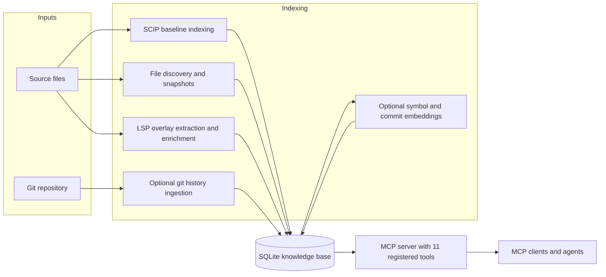

<div align="center">

# Lore

[](https://github.com/jafreck/Lore/actions/workflows/ci.yml)
[](https://codecov.io/gh/jafreck/Lore)
[](https://www.npmjs.com/package/@jafreck/lore)
[](LICENSE)
[](https://nodejs.org)
[](https://www.typescriptlang.org)

</div>

**Structured code intelligence for MCP agents**

Lore stores source snapshots and compiler/language-server-derived code facts in
SQLite, then exposes them through MCP. The current implementation uses SCIP for
full baseline indexes and LSP for incremental symbol/call extraction and
definition/type enrichment. It does **not** contain a tree-sitter fallback or a
documentation-indexing pipeline.

In the dated March 2026 benchmark snapshot, Lore-enabled agents improved overall
success by **5.6 percentage points** and correctness by **3.5 points**, while
using **31% fewer tokens** and **40% fewer tool calls**. Per-repository peaks
were **+7.5 points correctness**, **48% fewer tokens**, and **22% faster**.
Those results describe the historical harness and artifacts documented in the
[benchmark report](docs/benchmark-results.md); the current benchmark catalog and
scoring contract have since changed.

## Current capabilities

- Builds baseline symbols, imports, call references, type references, and
  relationships from available SCIP indexes/indexers.
- Stores source files, hashes, branches, and source snapshots even when no
  structural indexer is available for a file.
- Uses LSP `documentSymbol` and call hierarchy for changed-file overlay indexes,
  and hover/definition requests for persisted enrichment metadata.
- Resolves remaining references using definition containment and deterministic
  name-based fallbacks, recording the resolution method on each edge.
- Optionally ingests Git commits, touched-file statistics, and refs.
- Optionally embeds symbol signatures and commit messages for semantic search.
- Keeps an index fresh with one-shot refresh, watch mode, poll mode, or Git
  hooks; watch/poll can reconcile overlays with a deferred SCIP baseline rebuild.
- Serves 11 registered MCP tools over stdio.

Current limitations are intentional to state explicitly:

- The schema retains `annotations`, `symbol_metrics`, and `external_symbols`, but
  the active indexing pipeline does not populate annotations, complexity
  metrics, or dependency declaration APIs.
- The `lore_metrics` module still exists for direct/test use, but it is not
  registered by the MCP server and new indexes do not populate its metrics table.
- Structural coverage depends on an available SCIP index/indexer for baseline
  builds or a usable language server during incremental updates.

## How Lore integrates with agents



See [docs/architecture.md](docs/architecture.md) for the exact pipeline, schema,
and read-path caveats.

## Recognized languages

The file walker and default LSP registry recognize 23 languages:

- C, C++, C#
- Rust, Go, Java, Kotlin, Scala, Swift, Objective-C, Zig
- Python, JavaScript, TypeScript, PHP, Ruby, Lua, Bash, Elixir
- OCaml, Haskell, Julia, Elm

This is discovery/LSP coverage, not a promise that every baseline build produces
the same facts for every language. The default SCIP registry covers TypeScript,
Python, Java, Scala, Kotlin, Rust, C, C++, C#, Ruby, PHP, and Go among the
recognized languages. It also contains a Dart entry, but `.dart` is not currently
recognized by the walker or LSP registry. Use `lore install-scip --list` to see
installable indexers; unavailable indexers are skipped.

## Install

```bash
npm install @jafreck/lore
```

Note: Lore uses native add-ons (`better-sqlite3` and `sqlite-vec`). A working
C/C++ toolchain may be required when prebuilt binaries are unavailable.

## Quick start (CLI)

```bash
# 1) Build an index
npx @jafreck/lore index --root ./my-project --db ./lore.db \
  --allow-subprocess-execution

# 2) Start MCP server over stdio
npx @jafreck/lore mcp --db ./lore.db
```

## Quick start (programmatic)

```ts
import { IndexBuilder } from '@jafreck/lore';

const builder = new IndexBuilder(
  './lore.db',
  { rootDir: './my-project' },
  undefined,
  {
    scip: true,
    lsp: false,
    execution: { allowSubprocessExecution: true },
  },
);

await builder.build();
```

The CLI and `IndexBuilder` resolve default SCIP/LSP registries and read
`.lore.config`, but repository configuration is an untrusted request: it can
enable a stage or point to precomputed data, but it cannot authorize a process,
build, custom command, or download. Programmatic callers can use simple
`scip: false` / `lsp: false` values or partial settings objects. Execution
permissions must be supplied separately through the host-owned `execution`
option. Constructing `IndexBuilder` performs no config parsing; malformed config
is reported by `resolveConfiguration()`, `build()`, `refresh()`, or
`baselineRebuild()`.

## Index health and migration-grade validation

`lore doctor` validates an existing knowledge base without walking the source
tree again. It reports file/symbol/call/type/import coverage by language and
extension, symbol-less files, invalid persisted spans, duplicate active paths
and symbols, resolution methods and rates, unresolved references that appear
internal, indexer/SCIP/compilation-database provenance, and overlay freshness.
Import coverage separates exact internal resolutions, external dependencies,
heuristic internal matches, and unresolved imports.

```bash
# Concise terminal report
npx @jafreck/lore doctor --db ./lore.db

# Stable machine-readable report; exits non-zero when policy errors are found
npx @jafreck/lore doctor --db ./lore.db --json

# Enforce migration-grade completeness over selected/core files
npx @jafreck/lore doctor --db ./lore.db --root ./my-project \
  --validation-profile migration-grade \
  --include 'src/**' --exclude '**/*.generated.*' --required 'src/core/**' \
  --min-symbol-coverage 0.98
```

`lore validate` is an alias for `lore doctor`. The public API returns the same
JSON-ready report:

```ts
import { formatIndexHealthReport, validateIndex } from '@jafreck/lore';

const report = validateIndex('./lore.db', {
  rootDir: './my-project',
  policy: {
    profile: 'migration-grade',
    includeGlobs: ['src/**'],
    excludeGlobs: ['**/*.generated.*'],
    requiredGlobs: ['src/core/**'],
    thresholds: { minSymbolCoverage: 0.98, maxInvalidSpans: 0 },
    languages: {
      c: { minSymbolCoverage: 1, minCallResolutionRate: 0.9 },
    },
  },
});
console.log(formatIndexHealthReport(report));
```

Profiles are cumulative in intent:

- `standard` reports degradation and only fails explicit thresholds, required
  globs, or hard active-path corruption.
- `strict` also requires structural symbols for selected languages, symbols in
  selected files, valid spans, and no relevant failed/degraded indexer or
  compilation-database attempt.
- `migration-grade` adds persisted successful structural provenance so the
  result can be reproduced and audited. The latest baseline attempt must be
  completed successfully, match the selected root/branch and promoted
  generation, and contain a successful SCIP or LSP provider for every selected
  language.

Put a policy under `validation` in `.lore.config` to make `IndexBuilder`,
`lore index`, first-time `lore refresh`, and MCP auto-indexing enforce it after
the pipeline completes. A failed policy leaves the database available for
diagnosis but rejects the build:

```json
{
  "validation": {
    "profile": "migration-grade",
    "includeGlobs": ["src/**", "include/**"],
    "excludeGlobs": ["**/*.generated.*"],
    "requiredGlobs": ["src/core/**"],
    "thresholds": {
      "minSymbolCoverage": 0.98,
      "maxInvalidSpans": 0,
      "maxUnresolvedInternalRefs": 0
    },
    "languages": {
      "c": { "minSymbolCoverage": 1 },
      "typescript": { "minCallResolutionRate": 0.9 }
    }
  }
}
```

Run provenance is stored in `index_runs` and `indexer_runs`. It records run
mode/generation, attempted/succeeded/failed providers, SCIP artifact identity,
compilation-database validation and hashes, and whether an LSP/source fallback
degraded. Existing C/C++ reproducibility metadata remains reported as legacy
provenance when it is present in an otherwise compatible database.

Doctor and validate always open the database read-only. An older incompatible
schema returns a structured `SCHEMA_OUTDATED` error with missing capabilities;
it is never upgraded as a side effect of inspection. Upgrade in place only with
the explicit command `lore migrate --db ./lore.db`, or rebuild into a new
database with the current Lore version.

## MCP tools

| Tool | Purpose |
|------|----------|
| `lore_lookup` | Find symbols by name or files by path; symbol mode supports exact, semantic, and fused retrieval and returns persisted enrichment metadata when present |
| `lore_search` | Structural BM25, semantic vector, or fused RRF search over indexed symbols |
| `lore_dependents` | Find everything affected by changing a symbol or file — callers, importers, subclasses, and type references with automatic transitive traversal (up to 5 hops) in one call |
| `lore_trace` | Trace an execution path from an entry point and return an ordered call sequence with source code for each step |
| `lore_diff` | Compare exported symbols between two indexed branches; returns added, removed, and changed symbols |
| `lore_cohesion` | Rank directories globally by module cohesion and instability at a configurable grouping depth |
| `lore_structure` | Detect directory-level import cycles (Tarjan SCC), DFS-derived layering violations, and weak cross-directory outliers |
| `lore_graph` | Query stored call/import/inheritance/type-dependency edges with automatic transitive traversal (up to 5 hops); supports outbound `source_id` and inbound `target_id` queries |
| `lore_snippet` | Return snippets from indexed source snapshots by file path + line range or by symbol name; path/symbol resolution is branch-aware and responses include containing-symbol context metadata (name, kind, start/end lines) when available |
| `lore_blame` | Query blame, line-range history, or ownership aggregates with optional symbol targeting, commit-context enrichment, and risk signals |
| `lore_history` | Query commit history by file, commit, author, ref, recency, or semantic commit-message similarity |

The server serializes tool results as JSON text and adds `freshness` to object
results when possible. `freshness.source` is `baseline` when no dirty overlays
exist and `mixed` otherwise.

### lore_lookup query options

For symbol lookups (`kind: "symbol"`), `lore_lookup` supports:

- `match_mode`: optional symbol-name matching mode (`exact`, `prefix`, `contains`); defaults to `exact` (case-insensitive).
- `symbol_kind`: optional symbol kind filter (for example, `function` or `class`).
- `path_prefix`: optional indexed file-path prefix filter.
- `language`: optional indexed file language filter.
- `limit`: optional maximum rows for empty/browse symbol queries (default `20`).
- `offset`: optional rows to skip for empty/browse symbol queries (default `0`).

Example symbol lookup requests:

```json
{ "kind": "symbol", "query": "IndexBuilder", "match_mode": "prefix", "symbol_kind": "class" }
{ "kind": "symbol", "query": "", "path_prefix": "src/indexer/", "language": "typescript", "limit": 20, "offset": 20 }
```

### MCP config example

```json
{
  "mcpServers": {
    "lore": {
      "command": "npx",
      "args": ["@jafreck/lore", "mcp", "--db", "/path/to/lore.db"]
    }
  }
}
```


### lore_search filter parameters

`lore_search` supports additional optional filters to narrow symbol hits:

| Parameter | Applies to | Description |
|-----------|------------|-------------|
| `path_prefix` | Symbol results | Restrict symbol hits to files whose source path starts with the prefix |
| `language` | Symbol results | Restrict symbol hits to indexed file language (for example `typescript`, `python`) |
| `kind` | Symbol results | Restrict symbol hits to a symbol kind (for example `function`, `class`) |

Mode behavior:

- `structural`: returns symbol hits only; applies `path_prefix`, `language`, and `kind`.
- `semantic`: returns nearest embedded symbols and falls back to structural mode when an embedding provider is unavailable.
- `fused`: combines structural and semantic symbol candidates with reciprocal-rank fusion; the same symbol filters apply to both candidate sets.

### lore_history modes

| Mode | Query |
|------|-------|
| `recent` | Newest commits |
| `semantic` | Conceptual commit-message search (falls back to `recent` when vectors are unavailable) |
| `file` | Commits that touched a path |
| `commit` | Full/prefix SHA lookup (+files +refs) |
| `author` | Commits by author/email substring |
| `ref` | Commits matching branch/tag ref name |

### lore_blame examples

```json
{ "path": "/repo/src/index.ts", "line": 120 }
{ "path": "/repo/src/index.ts", "start_line": 120, "end_line": 140 }
{ "path": "/repo/src/index.ts", "line": 120, "ref": "main" }
{ "symbol": "handleAuth", "path": "/repo/src/auth.ts", "branch": "main" }
{ "mode": "history", "symbol": "handleAuth", "path": "/repo/src/auth.ts", "ref": "main" }
{ "mode": "ownership", "path": "/repo/src", "scope": "directory", "ref": "main" }
```

Legacy line and line-range requests remain fully supported; `mode` defaults to `"blame"` when omitted.  
History and ownership responses include commit context (`commits`, `history[*].commit_context` with message/files/refs) and `risk` indicators (`recency`, `author_dispersion`, `churn`, `overall`), and symbol-targeted requests return `resolved_symbol`.

## Data ingestion

Lore indexes multiple data sources into a normalized SQLite schema. Each source
has its own ingestion pipeline and can be enabled independently.

### Source code

The baseline path runs available, host-authorized SCIP indexers (or reads
precomputed `.scip` files without execution permission), stores their
symbols/imports/relationships/references, discovers the
remaining recognized source files, resolves imports, optionally enriches
non-SCIP data through LSP, refreshes FTS, resolves remaining edges, updates
reverse dependencies, and optionally embeds symbols.

Incremental updates use a separate overlay: file discovery stores changed
snapshots, `LspExtractionStage` uses document symbols and outgoing call
hierarchy, and LSP hover/definition enrichment runs before name-based
resolution. `ScipIndexerStage` intentionally skips overlay updates. Watch and
poll modes schedule a full SCIP baseline reconciliation after a quiet period
when SCIP settings are present.

There is no tree-sitter parser or per-language extractor path in v0.4.0.

Programmatic example:

```ts
import { IndexBuilder } from '@jafreck/lore';

await new IndexBuilder('./lore.db', {
  rootDir: './my-project',
  includeGlobs: ['src/**'],
  excludeGlobs: ['**/*.gen.ts'],
  extensions: ['.ts', '.tsx'],
}).build();
```

This example only configures discovery and therefore starts no subprocesses.
Use `scip` / `lsp` booleans or partial overrides in the fourth argument, plus a
separate `execution` grant when structural tools may run.

### SCIP settings

The CLI resolves SCIP as enabled by default with a 120-second timeout per
indexer. `--no-scip` force-disables it. Enabled does **not** mean executable:
all subprocess, build, custom-command, and automatic-install capabilities are
denied unless the host supplies explicit CLI flags or programmatic execution
options. A `.lore.config` file may request settings and provide precomputed
indexes, but it is never a trust source:

```json
{
  "scip": {
    "enabled": true,
    "timeoutMs": 120000,
    "allowBuildExecution": true,
    "autoInstall": true,
    "indexDir": "./scip-indexes",
    "indexers": {
      "typescript": {
        "command": "scip-typescript",
        "args": ["index", "--output", "{output}"]
      }
    }
  }
}
```

In this example, `allowBuildExecution`, `autoInstall`, and the custom `indexers`
entry remain inert unless the process owner separately grants the corresponding
capabilities. A repository may set either request to `false` to suppress an
otherwise host-authorized operation, but setting it to `true` cannot grant one.

`indexDir` is resolved from the indexed root. Lore first looks for
`index.scip` and per-language files there. Valid precomputed SCIP data is read
without any execution permission. Otherwise Lore detects project languages from
the effective registry and, when authorized, resolves indexers from
`~/.lore/bin`, Lore's bundled npm binaries, and `PATH`. Automatic installation
is attempted only with `--allow-auto-install` (or `allowAutoInstall: true` in
host options). Failed, unavailable, or policy-blocked indexers are skipped.

For C/C++, Lore validates and reuses an existing `compile_commands.json`
without build permission. Only the host CLI `--allow-build-execution` flag or
programmatic `execution.allowBuildExecution: true` permits CMake, Meson,
configure, or Make to run when a database must be generated. The similarly
named `.lore.config` field is only a request and cannot authorize the build.
Compdb identity, indexer identity, and coverage counts are recorded in
`lore_meta` under `scip_c_cpp_reproducibility`.

Compiler response files are expanded with resource budgets applied separately
to each compilation entry. `IndexBuilderOptions.responseFileLimits` can
override `maxBytesPerFile`, `maxTotalBytesPerEntry`, `maxFilesPerEntry`, and
`maxDepth`. If a budget, cycle, read error, or nesting limit prevents expansion,
Lore retains the original `@file` argument and marks both the entry and compdb
validation as degraded; it never silently drops opaque compiler flags.

Custom SCIP command, argument, and working-directory overrides require
`--allow-custom-indexer-commands` or
`execution.allowCustomIndexerCommands: true`. A command cwd must resolve inside
the indexed root. Extra roots require repeatable `--allow-command-cwd <dir>`
flags or programmatic `execution.allowedCwdRoots`; real paths are checked so a
symlink cannot escape the allowlist.

#### Execution trust reference

| Capability | CLI host opt-in | Programmatic host opt-in |
|------------|-----------------|--------------------------|
| Built-in SCIP indexers and LSP servers | `--allow-subprocess-execution` | `execution.allowSubprocessExecution` |
| Repository/custom SCIP command, args, or cwd | `--allow-custom-indexer-commands` | `execution.allowCustomIndexerCommands` |
| Repository/custom LSP command, args, or cwd | `--allow-custom-lsp-commands` | `execution.allowCustomLspCommands` |
| C/C++ configure/build generation | `--allow-build-execution` | `execution.allowBuildExecution` |
| Automatic SCIP download/install | `--allow-auto-install` | `execution.allowAutoInstall` |
| Command cwd outside the indexed root | `--allow-command-cwd <dir>` | `execution.allowedCwdRoots` |

Specific command/build/install grants permit the subprocesses needed for that
capability; they do not grant unrelated categories. These values must come from
the process invocation or host API object. Automation should treat checked-out
`.lore.config` files exactly like source code: useful input, never authority.
See [docs/execution-trust.md](docs/execution-trust.md) for the complete trust
boundary and programmatic examples.


### Git history

Lore ingests commits, touched files (with change type and diff stats), and
refs (branches/tags). Enable with `--history`. History ingestion currently
traverses all refs by default, so `--history-all` is an explicit but redundant
request for the same behavior; use `--history-depth <n>` to cap commits.

Indexed tables:

- `commits` — sha, author, author_email, timestamp, message, parents
- `commit_files` — per-commit touched paths with change type and diff stats
- `commit_refs` — refs currently pointing at commits (`branch`/`tag`/`other`)
- `commit_embeddings` — commit-message vectors keyed to `commits` for semantic history retrieval

Programmatic example:

```ts
await new IndexBuilder('./lore.db', {
  rootDir: './my-project',
}, undefined, {
  history: { all: true, depth: 2000 },
}).build();
```

This example focuses on history options. SCIP/LSP booleans or partial overrides
may be added directly; any process capability still belongs under the separate
host-owned `execution` option.


### Embeddings

Lore optionally generates dense vector embeddings for semantic search using
`@huggingface/transformers` (Transformers.js), which runs ONNX models natively
in Node.js — no Python process is required. Embeddings are disabled unless
`--embeddings` or `--embedding-model` is supplied. The default model is
`onnx-community/Qwen3-Embedding-0.6B-ONNX`; its dimensionality is detected at
initialization. Override it with `--embedding-model`:

```bash
npx @jafreck/lore index --root ./my-project --db ./lore.db \
  --embedding-model 'nomic-ai/nomic-embed-text-v1.5'
```

The default execution device is CPU. `LORE_EMBED_DEVICE` can request another
Transformers.js execution provider; unsupported non-CPU providers fall back to
CPU when reported as unsupported. Quantized ONNX dtype defaults to `q8` and is
configurable as `fp32`, `fp16`, `q8`, or `q4` with `LORE_EMBED_DTYPE`. During
updates, unchanged **symbol** embedding inputs are skipped by SHA-256 hash.

At query time, `lore_search` in `semantic` or `fused` mode embeds the query
and performs cosine similarity against stored vectors. If the model cannot
initialize, search gracefully degrades to structural BM25.
When history indexing is enabled, Lore also stores commit-message vectors in
`commit_embeddings` so `lore_history` can serve semantic commit retrieval.

### LSP enrichment

Lore can persist type and definition metadata by querying language servers at
index time. It also uses `documentSymbol` and call hierarchy for overlay
extraction. Enriched columns include:

- `resolved_type_signature`, `resolved_return_type`
- `definition_uri`, `definition_path`

These are persisted on `symbols`, `symbol_refs`, `type_refs`, and
`symbol_relationships` as applicable. MCP query handlers read the stored values;
they do not invoke language servers.

LSP precedence:

1. CLI flag (`--lsp`)
2. `.lore.config` `lsp.enabled`
3. Built-in default (`true`)

This precedence controls whether the stage is requested, not whether a process
may start. Built-in server mappings require `--allow-subprocess-execution` (or
programmatic `execution.allowSubprocessExecution: true`). Custom command,
argument, or cwd entries additionally require `--allow-custom-lsp-commands` (or
`execution.allowCustomLspCommands: true`); the broad subprocess flag does not
trust repository overrides. Use `--no-lsp` to override repository settings and
disable LSP. Likewise, `--scip` and `--no-scip` provide symmetric SCIP
overrides. Supplying both sides of either pair is an error.

`.lore.config` example:

```json
{
  "lsp": {
    "enabled": true,
    "timeoutMs": 5000,
    "supplementation": {
      "maxFiles": 500,
      "fileConcurrency": 4,
      "strict": false
    },
    "servers": {
      "typescript": { "command": "typescript-language-server", "args": ["--stdio"], "cwd": "." },
      "python": { "command": "pyright-langserver", "args": ["--stdio"] }
    }
  }
}
```

Baseline LSP supplementation is planned only for files not sourced by SCIP and
for SCIP-sourced C/C++ files with no symbols or repairable spans. `maxFiles`
bounds best-effort work and emits an incomplete-plan warning when reached;
set `strict` to `true` for migrations or other completeness-sensitive builds so
reaching the cap fails the build instead. `fileConcurrency` bounds concurrent
document requests.

Default server mappings cover all 23 recognized languages:

| Language(s) | Default command |
|-------------|------------------|
| `c`, `cpp`, `objc` | `clangd` |
| `rust` | `rust-analyzer` |
| `python` | `pyright-langserver --stdio` |
| `typescript`, `javascript` | `typescript-language-server --stdio` |
| `go` | `gopls` |
| `java` | `jdtls` |
| `csharp` | `csharp-ls` |
| `ruby` | `solargraph stdio` |
| `php` | `intelephense --stdio` |
| `swift` | `sourcekit-lsp` |
| `kotlin` | `kotlin-language-server` |
| `scala` | `metals` |
| `lua` | `lua-language-server` |
| `bash` | `bash-language-server start` |
| `elixir` | `elixir-ls` |
| `zig` | `zls` |
| `ocaml` | `ocamllsp` |
| `haskell` | `haskell-language-server-wrapper --lsp` |
| `julia` | `julia --startup-file=no --history-file=no --quiet --eval "using LanguageServer, SymbolServer; runserver()"` |
| `elm` | `elm-language-server` |

Install whichever language servers you need on `PATH`; unavailable servers are
auto-detected and skipped without failing indexing.

### Dependency API status

`--index-deps` and the programmatic `indexDependencies` option are still
accepted, but the current pipeline has no dependency-declaration crawler and
does not populate `external_symbols`. Existing databases can still contain
external symbols, and exact `lore_lookup` symbol queries can read them. Do not
rely on `--index-deps` to add dependency APIs in v0.4.0.

## Keeping the index fresh

The index stays current automatically through three mechanisms:

**Git hooks** — install once with `lore hooks`, and Lore refreshes on every
`post-commit`, `post-merge`, `post-checkout`, and `post-rewrite`:

```bash
npx @jafreck/lore hooks --root ./my-project --db ./lore.db --history
```

**Watch mode** — reacts to filesystem events in real time:

```bash
npx @jafreck/lore refresh --db ./lore.db --root ./my-project --watch
```

**Poll mode** — periodic mtime diffing, most reliable across filesystems:

```bash
npx @jafreck/lore refresh --db ./lore.db --root ./my-project --poll
```

Both watch and poll modes support live symbol embeddings when an embedding model
is configured. Watch mode debounces filesystem events by 300 ms; poll mode uses
a 5-second interval by default. Both create the 10-second quiet-period baseline
rebuild scheduler whenever a SCIP settings object is supplied; the refresh CLI
supplies that object even when SCIP is disabled, in which case the scheduled
SCIP stage is a no-op. One-shot `refresh` hashes the configured walker scope and
updates only creations, content changes, and indexed paths that were deleted.
The repeatable `--include`, `--exclude`, and `--language` options construct one
walker scope shared unchanged by one-shot refresh, watch, poll, and MCP live
refresh.

## CLI reference

### lore index

Build a baseline knowledge base. SCIP and LSP stages default to enabled, while
process execution defaults to denied. Unavailable or policy-blocked executables
are skipped; precomputed SCIP and compilation databases remain readable.

```bash
npx @jafreck/lore index --root <dir> --db <path> \
  [--embeddings] [--embedding-model <id>] \
  [--history] [--history-depth <n>] [--history-all] \
  [--include <glob>] [--exclude <glob>] [--language <lang>] \
  [--lsp|--no-lsp] [--scip|--no-scip] [--max-workers <n>] \
  [--allow-subprocess-execution] [--allow-build-execution] \
  [--allow-custom-indexer-commands] [--allow-custom-lsp-commands] \
  [--allow-auto-install] [--allow-command-cwd <dir>] \
  [--validation-profile <standard|strict|migration-grade>] [--required <glob>]
```

`--include`, `--exclude`, and `--language` are repeatable. `--max-workers` is
accepted and placed in pipeline context, but the current pipeline has no parse
worker stage that consumes it. `--index-deps` is also accepted but has the
dependency-API limitation described above.

CLI parsing is strict and command-scoped: unknown options, positional
arguments, duplicate non-repeatable options, and missing option values are
rejected. `--watch` and `--poll`, provider enable/disable pairs, and embedding
enable/disable pairs are mutually exclusive where applicable.

### lore doctor / lore validate

Inspect an existing index and optionally enforce a configured or command-line
policy. `--include`, `--exclude`, and `--required` are repeatable. Rate values
are decimal numbers from `0` through `1`.

```bash
npx @jafreck/lore doctor --db <path> [--root <dir>] [--branch <name>] [--json] \
  [--validation-profile <standard|strict|migration-grade>] \
  [--include <glob>] [--exclude <glob>] [--required <glob>] \
  [--min-symbol-coverage <rate>] \
  [--min-call-resolution-rate <rate>] \
  [--min-type-resolution-rate <rate>] \
  [--min-import-resolution-rate <rate>]
```

### lore refresh

Incremental refresh (one-shot, watch, or poll).

```bash
npx @jafreck/lore refresh --db <path> --root <dir> [--include <glob>] [--exclude <glob>] [--language <lang>] [--index-deps] [--history] [--history-depth <n>] [--history-all] [--lsp|--no-lsp] [--scip|--no-scip] [execution flags]
npx @jafreck/lore refresh --db <path> --root <dir> --watch [--include <glob>] [--exclude <glob>] [--language <lang>] [--embedding-model <id>] [--history] [--lsp|--no-lsp] [--scip|--no-scip] [execution flags]
npx @jafreck/lore refresh --db <path> --root <dir> --poll [--include <glob>] [--exclude <glob>] [--language <lang>] [--embedding-model <id>] [--history] [--lsp|--no-lsp] [--scip|--no-scip] [execution flags]
```

### lore hooks

Install repo-local git hooks for automatic refresh.

```bash
npx @jafreck/lore hooks --root <repo> --db <path> [--history] [--history-depth <n>] [--history-all] [--lsp|--no-lsp] [--scip|--no-scip] [execution flags]
```

The hook generator preserves existing non-Lore hook content and installs
`post-commit`, `post-merge`, `post-checkout`, and `post-rewrite`. Any of
`--history`, `--history-depth`, or `--history-all` causes generated hooks to pass
plain `--history`; depth/all details are not preserved in the hook script.


### lore mcp

Start the MCP server over stdio. When `--root` is given and no database exists
yet, Lore creates `<root>/.lore/lore.db` and runs `IndexBuilder` before starting.
That auto-index path resolves `.lore.config` as untrusted input. No repository
setting can grant process, custom-command, build, or installation permission;
the same explicit CLI trust flags are required.

```bash
npx @jafreck/lore mcp --root <dir> [--watch|--poll] [--include <glob>] [--exclude <glob>] [--language <lang>] [execution flags]
npx @jafreck/lore mcp --db <path> [--root <dir> --watch|--poll] [--include <glob>] [--exclude <glob>] [--language <lang>] [execution flags]
```

`--watch` and `--poll` are mutually exclusive and require `--root`.

### lore analyze

Run graph analysis and print JSON. `--mode` is `summary` (default), `cycles`,
`components`, or `clusters`; `--edge-kinds` is `both` (default), `call`, or
`type`.

```bash
npx @jafreck/lore analyze --db <path> [--mode <mode>] [--edge-kinds <kind>] [--branch <name>] [--max-lines <n>]
```

### lore install-scip

List or install supported SCIP indexers.

```bash
npx @jafreck/lore install-scip --list
npx @jafreck/lore install-scip [--language <lang>]
```

All subcommands accept `--log-level <debug|info|warn|error|silent>` and
`--log-file <path>`. With a `--db` path and no explicit log path, the CLI
derives the log path by replacing the DB path's final extension with `.log`.

## Build from source

```bash
git clone https://github.com/jafreck/Lore.git
cd Lore
npm install
npm run typecheck
npm run build
```

## Contributing

Environment expectations:

- Node.js `>=22.0.0`
- Native build toolchain for `better-sqlite3`

Common local workflow:

```bash
npm run build
npm run typecheck
npm test
npm run coverage
```

Vitest currently enforces minimum coverage thresholds of 73% statements, 60%
branches, 78% functions, and 75% lines. Codecov's project and patch targets are
70% with a 2% threshold.
