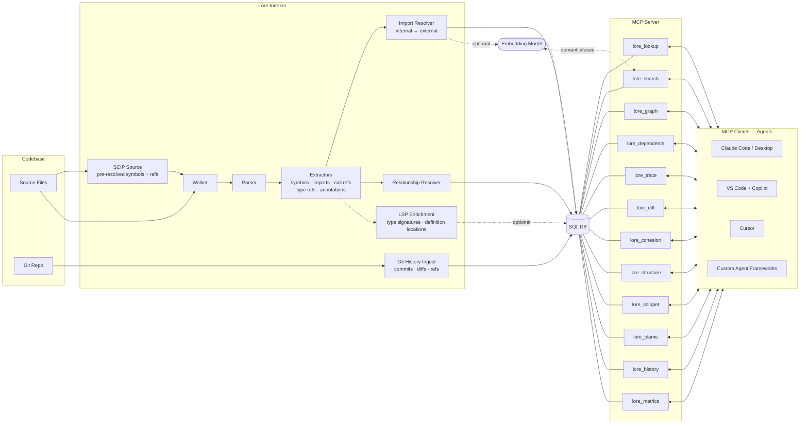

<div align="center">

# Lore

[](https://github.com/jafreck/Lore/actions/workflows/ci.yml)
[](https://codecov.io/gh/jafreck/Lore)
[](https://www.npmjs.com/package/@jafreck/lore)
[](LICENSE)
[](https://nodejs.org)
[](https://www.typescriptlang.org)

</div>

**The teammate that knows it all** 

Lore holds the structural knowledge over the codebase in memory so your agent doesn't have to. Lore indexes your code into a structured knowledge base that agents query through MCP. It fully maps symbols, imports, call relationships, type relationships, annotations, docs, and all git data — with optional embeddings for semantic search — so agents can reason about your codebase without re-reading it from scratch.

Lore-enabled agents achieve up to **+10pp higher correctness**, up to **84% fewer tokens**, and up to **62% faster wall-clock time** compared to a baseline agent with grep and file reads alone. See the [full benchmark results](docs/benchmark-results.md) for details.

## What Lore does

- Indexes source files using SCIP indexers by default for pre-resolved symbols and edges, with tree-sitter parsing as a fallback for languages without a SCIP indexer
- Extracts symbols, imports, call refs, type refs, and annotations across all 23 supported languages
- Resolves internal vs external imports and builds call/import/module/inheritance/type-dependency graph edges using a 3-tier resolution strategy (SCIP/LSP containment, same-file name match, unique name match)
- Discovers and indexes documentation (`.md`, `.rst`, `.adoc`, `.txt`) with inferred kinds/titles
- Stores everything in a normalized SQL schema with optional vector search
- Enables RAG-style retrieval with semantic/fused search across symbols and doc sections
- Indexes git history (commits, touched files, refs/branches/tags)
- Enriches symbols with resolved type signatures and definitions via optional index-time LSP integration (batch-pipelined hover + definition requests)
- Supports line-level git blame through MCP
- Supports automatic refresh via watch mode, poll mode, and git hooks

## How Lore integrates with LLMs



Lore sits between your codebase and any LLM-powered tool. The indexer uses a SCIP-first strategy with tree-sitter fallback to extract symbols, imports, and relationships, then persists everything to a normalized SQL database. The MCP server auto-discovers tool modules and exposes the database to any MCP-compatible client. The index stays fresh via git hooks, watch mode, or poll mode — each refresh only re-processes files whose content hash has changed.

See [docs/architecture.md](docs/architecture.md) for the full schema and
pipeline breakdown.

## Supported languages

Lore currently supports extractors for:

- C, C++, C#
- Rust, Go, Java, Kotlin, Scala, Swift, Objective-C, Zig
- Python, JavaScript, TypeScript, PHP, Ruby, Lua, Bash, Elixir
- OCaml, Haskell, Julia, Elm

## Install

```bash
npm install @jafreck/lore
```

Note: Lore uses native add-ons (`tree-sitter`, `better-sqlite3`). A working
C/C++ toolchain is required the first time dependencies are built.

## Quick start (CLI)

```bash
# 1) Build an index
npx @jafreck/lore index --root ./my-project --db ./lore.db

# 2) Start MCP server over stdio
npx @jafreck/lore mcp --db ./lore.db
```

## Quick start (programmatic)

```ts
import { IndexBuilder } from '@jafreck/lore';

const builder = new IndexBuilder(
  './lore.db',
  { rootDir: './my-project' },
  undefined,
  { history: true },
);

await builder.build();
```

## MCP tools

| Tool | Purpose |
|------|----------|
| `lore_lookup` | Find symbols by name or files by path, including external dependency API symbols and LSP-resolved metadata when available |
| `lore_search` | Structural BM25, semantic vector, or fused RRF search across symbols and doc sections |
| `lore_dependents` | Find everything affected by changing a symbol or file — callers, importers, subclasses, and type references with automatic transitive traversal (up to 5 hops) in one call |
| `lore_trace` | Trace an execution path from an entry point and return an ordered call sequence with source code for each step |
| `lore_diff` | Compare exported symbols between two indexed branches; returns added, removed, and changed symbols |
| `lore_cohesion` | Rank directories by module cohesion (ratio of internal to external symbol references) |
| `lore_structure` | Detect structural anomalies — import cycles (Tarjan SCC), layering violations (Kahn toposort), and outlier couplings |
| `lore_graph` | Query call/import/inheritance/type-dependency edges with automatic transitive traversal (up to 5 hops); supports `source_id` for outbound and `target_id` for inbound/reverse queries; materializes virtual dispatch edges for polymorphic call resolution |
| `lore_snippet` | Return snippets from indexed source snapshots by file path + line range or by symbol name; path/symbol resolution is branch-aware and responses include containing-symbol context metadata (name, kind, start/end lines) when available |
| `lore_blame` | Query blame, line-range history, or ownership aggregates with optional symbol targeting, commit-context enrichment, and risk signals |
| `lore_history` | Query commit history by file, commit, author, ref, recency, or semantic commit-message similarity |
| `lore_metrics` | Aggregate index metrics |

### lore_lookup query options

For symbol lookups (`kind: "symbol"`), `lore_lookup` supports:

- `match_mode`: optional symbol-name matching mode (`exact`, `prefix`, `contains`); defaults to `exact` (case-insensitive).
- `symbol_kind`: optional symbol kind filter (for example, `function` or `class`).
- `path_prefix`: optional indexed file-path prefix filter.
- `language`: optional indexed file language filter.
- `limit`: optional maximum rows for empty/browse symbol queries (default `20`).
- `offset`: optional rows to skip for empty/browse symbol queries (default `0`).

Example symbol lookup requests:

```json
{ "kind": "symbol", "query": "IndexBuilder", "match_mode": "prefix", "symbol_kind": "class" }
{ "kind": "symbol", "query": "", "path_prefix": "src/indexer/", "language": "typescript", "limit": 20, "offset": 20 }
```

### MCP config example

```json
{
  "mcpServers": {
    "lore": {
      "command": "npx",
      "args": ["@jafreck/lore", "mcp", "--db", "/path/to/lore.db"]
    }
  }
}
```


### lore_search filter parameters

`lore_search` supports additional optional filters to narrow symbol hits:

| Parameter | Applies to | Description |
|-----------|------------|-------------|
| `path_prefix` | Symbol results | Restrict symbol hits to files whose source path starts with the prefix |
| `language` | Symbol results | Restrict symbol hits to indexed file language (for example `typescript`, `python`) |
| `kind` | Symbol results | Restrict symbol hits to a symbol kind (for example `function`, `class`) |

Mode behavior:

- `structural`: returns symbol hits only; applies `path_prefix`, `language`, and `kind`.
- `fused`: combines structural and semantic candidates; symbol filters apply to symbol candidates and doc filters apply to semantic doc-section candidates before final fused ranking.

### lore_history modes

| Mode | Query |
|------|-------|
| `recent` | Newest commits |
| `semantic` | Conceptual commit-message search (falls back to `recent` when vectors are unavailable) |
| `file` | Commits that touched a path |
| `commit` | Full/prefix SHA lookup (+files +refs) |
| `author` | Commits by author/email substring |
| `ref` | Commits matching branch/tag ref name |

### lore_blame examples

```json
{ "path": "/repo/src/index.ts", "line": 120 }
{ "path": "/repo/src/index.ts", "start_line": 120, "end_line": 140 }
{ "path": "/repo/src/index.ts", "line": 120, "ref": "main" }
{ "symbol": "handleAuth", "path": "/repo/src/auth.ts", "branch": "main" }
{ "mode": "history", "symbol": "handleAuth", "path": "/repo/src/auth.ts", "ref": "main" }
{ "mode": "ownership", "path": "/repo/src", "scope": "directory", "ref": "main" }
```

Legacy line and line-range requests remain fully supported; `mode` defaults to `"blame"` when omitted.  
History and ownership responses include commit context (`commits`, `history[*].commit_context` with message/files/refs) and `risk` indicators (`recency`, `author_dispersion`, `churn`, `overall`), and symbol-targeted requests return `resolved_symbol`.

## Data ingestion

Lore indexes multiple data sources into a normalized SQLite schema. Each source
has its own ingestion pipeline and can be enabled independently.

### Source code

The indexer uses a SCIP-first strategy: for languages with a SCIP indexer it
produces symbols and pre-resolved edges directly, then falls back to tree-sitter
parsing for remaining languages. Optional LSP enrichment can augment symbols
from either path. The import resolver classifies each import as internal or
external, and a call-graph builder creates edges between symbols.

Programmatic example:

```ts
import { IndexBuilder } from '@jafreck/lore';

await new IndexBuilder('./lore.db', {
  rootDir: './my-project',
  includeGlobs: ['src/**'],
  excludeGlobs: ['**/*.gen.ts'],
  extensions: ['.ts', '.tsx'],
}).build();
```


### Git history

Lore ingests commits, touched files (with change type and diff stats), and
refs (branches/tags). Enable with `--history`; use `--history-all` to traverse
all refs and `--history-depth <n>` to cap the number of commits.

Indexed tables:

- `commits` — sha, author, author_email, timestamp, message, parents
- `commit_files` — per-commit touched paths with change type and diff stats
- `commit_refs` — refs currently pointing at commits (`branch`/`tag`/`other`)
- `commit_embeddings` — commit-message vectors keyed to `commits` for semantic history retrieval

Programmatic example:

```ts
await new IndexBuilder('./lore.db', {
  rootDir: './my-project',
}, undefined, {
  history: { all: true, depth: 2000 },
}).build();
```


### Embeddings

Lore optionally generates dense vector embeddings for semantic search using
`@huggingface/transformers` (Transformers.js), which runs ONNX models natively
in Node.js — no Python or external processes required. The default model is
`Qwen/Qwen3-Embedding-0.6B` (1024-dim); override with `--embedding-model`:

```bash
npx @jafreck/lore index --root ./my-project --db ./lore.db \
  --embedding-model 'nomic-ai/nomic-embed-text-v1.5'
```

Hardware acceleration is automatic: CoreML on Apple Silicon, WebGPU when
available, CPU elsewhere. Override via the `LORE_EMBED_DEVICE` env var.
Quantized ONNX dtype (fp32/fp16/q8/q4) is configurable with `LORE_EMBED_DTYPE`.
In update/watch/poll mode, symbols and docs whose embedding text is unchanged
(SHA-256 hash comparison) are skipped entirely for fast incremental re-embeds.

At query time, `lore_search` in `semantic` or `fused` mode embeds the query
and performs cosine similarity against stored vectors. If the model cannot
initialize, search gracefully degrades to structural BM25.
When history indexing is enabled, Lore also stores commit-message vectors in
`commit_embeddings` so `lore_history` can serve semantic commit retrieval.

### LSP enrichment

Lore can enrich symbols and call refs with resolved type metadata at index time
by querying language servers via the Language Server Protocol. Enriched columns:

- `resolved_type_signature`, `resolved_return_type`
- `definition_uri`, `definition_path`

These are persisted in `symbols`, `symbol_refs`, and `external_symbols` tables.
`lore_lookup` and `lore_search` return them when present. Query handlers stay
SQLite-only — language servers are never invoked at runtime.

LSP precedence:

1. CLI flag (`--lsp`)
2. `.lore.config` `lsp.enabled`
3. Built-in default (`false`)

`.lore.config` example:

```json
{
  "lsp": {
    "enabled": true,
    "timeoutMs": 5000,
    "servers": {
      "typescript": { "command": "typescript-language-server", "args": ["--stdio"] },
      "python": { "command": "pyright-langserver", "args": ["--stdio"] }
    }
  }
}
```

Default server mappings cover all supported extractor languages:

| Language(s) | Default command |
|-------------|------------------|
| `c`, `cpp`, `objc` | `clangd` |
| `rust` | `rust-analyzer` |
| `python` | `pyright-langserver --stdio` |
| `typescript`, `javascript` | `typescript-language-server --stdio` |
| `go` | `gopls` |
| `java` | `jdtls` |
| `csharp` | `csharp-ls` |
| `ruby` | `solargraph stdio` |
| `php` | `intelephense --stdio` |
| `swift` | `sourcekit-lsp` |
| `kotlin` | `kotlin-language-server` |
| `scala` | `metals` |
| `lua` | `lua-language-server` |
| `bash` | `bash-language-server start` |
| `elixir` | `elixir-ls` |
| `zig` | `zls` |
| `ocaml` | `ocamllsp` |
| `haskell` | `haskell-language-server-wrapper --lsp` |
| `julia` | `julia --startup-file=no --history-file=no --quiet --eval "using LanguageServer, SymbolServer; runserver()"` |
| `elm` | `elm-language-server` |

Install whichever language servers you need on `PATH`; unavailable servers are
auto-detected and skipped without failing indexing.

### Dependency APIs

Lore can index declaration-level public API surface from direct dependencies.
Enable with `--index-deps` or `indexDependencies: true` programmatically.

Supported ecosystems:

- **TypeScript/JavaScript** — exported declarations from `.d.ts` files in direct npm dependencies
- **Python** — stubbed/public declarations from direct dependencies via `.pyi` and `py.typed`
- **Go** — exported declarations from direct module requirements in `go.mod`
- **Rust** — `pub` declarations from crates in `Cargo.toml`

Implementation bodies are excluded and transitive dependencies are not crawled.

## Keeping the index fresh

The index stays current automatically through three mechanisms:

**Git hooks** — install once with `lore hooks`, and Lore refreshes on every
`post-commit`, `post-merge`, `post-checkout`, and `post-rewrite`:

```bash
npx @jafreck/lore hooks --root ./my-project --db ./lore.db --history
```

**Watch mode** — reacts to filesystem events in real time:

```bash
npx @jafreck/lore refresh --db ./lore.db --root ./my-project --watch
```

**Poll mode** — periodic mtime diffing, most reliable across filesystems:

```bash
npx @jafreck/lore refresh --db ./lore.db --root ./my-project --poll
```

Both watch and poll modes support **live embeddings** — when an embedding
model is configured, changed files have their vectors re-generated
incrementally during each refresh cycle.

Each refresh only re-processes files whose content hash has changed, so updates
are fast even on large repositories.

## CLI reference

### lore index

Build or update a knowledge base.

```bash
npx @jafreck/lore index --root <dir> --db <path> [--embedding-model <id>] [--blocking-embedder] [--index-deps] [--history] [--history-depth <n>] [--history-all] [--include <glob>] [--exclude <glob>] [--language <lang>] [--lsp] [--no-scip]
```

### lore refresh

Incremental refresh (one-shot, watch, or poll).

```bash
npx @jafreck/lore refresh --db <path> --root <dir> [--index-deps] [--history] [--history-depth <n>] [--history-all] [--lsp] [--no-scip]
npx @jafreck/lore refresh --db <path> --root <dir> --watch [--index-deps] [--history] [--lsp] [--no-scip]
npx @jafreck/lore refresh --db <path> --root <dir> --poll [--index-deps] [--history] [--lsp] [--no-scip]
```

### lore hooks

Install repo-local git hooks for automatic refresh.

```bash
npx @jafreck/lore hooks --root <repo> --db <path> [--history] [--lsp] [--no-scip]
```


### lore mcp

Start the MCP server over stdio. When `--root` is given and no database exists
yet, Lore auto-indexes before starting.

```bash
npx @jafreck/lore mcp --root <dir> [--watch|--poll]
npx @jafreck/lore mcp --db <path> [--root <dir> --watch|--poll] [--blocking-embedder]
```

## Build from source

```bash
git clone https://github.com/jafreck/Lore.git
cd Lore
npm install
npm run build
```

## Contributing

Environment expectations:

- Node.js `>=22.0.0`
- Native build toolchain for `tree-sitter` and `better-sqlite3`

Common local workflow:

```bash
npm run build
npm test
npm run coverage
```

CI currently enforces minimum coverage thresholds of 77% statements, 64%
branches, 80% functions, and 79% lines.
