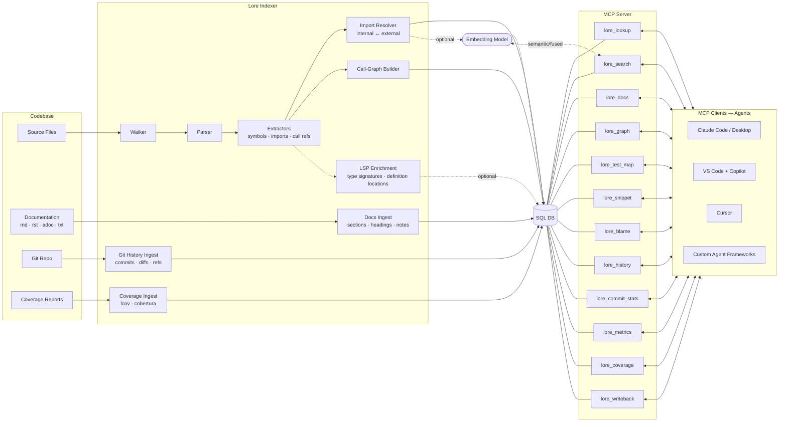

# Lore

[](https://github.com/jafreck/Lore/actions/workflows/ci.yml)
[](https://codecov.io/gh/jafreck/Lore)
[](https://www.npmjs.com/package/@jafreck/lore)
[](LICENSE)
[](https://nodejs.org)
[](https://www.typescriptlang.org)

**The teammate that has seen it all** 

Lore is your agent's institutional knowledge over the codebase — it knows what was built, why it changed, and how it all connects. Lore indexes your code and git history into a structured knowledge base that agents query through MCP. It maps symbols, imports, call relationships, and git history — with optional embeddings for semantic search — so agents can reason about your codebase
without re-reading it from scratch.

## What Lore does

- Parses source files and extracts symbols, imports, and call refs
- Resolves internal vs external imports and builds call/import graph edges
- Discovers and indexes documentation (`.md`, `.rst`, `.adoc`, `.txt`) with inferred kinds/titles
- Stores everything in a normalized SQL schema with optional vector search
- Enables RAG-style retrieval with semantic/fused search across symbols and doc sections
- Indexes git history (commits, touched files, refs/branches/tags)
- Enriches symbols with resolved type signatures and definitions via optional index-time LSP integration
- Supports line-level git blame through MCP
- Supports automatic refresh via watch mode, poll mode, and git hooks

## How Lore integrates with LLMs



Lore sits between your codebase and any LLM-powered tool. The **indexer**
pipeline walks source files, parses them into ASTs, and extracts
symbols/imports/call-refs via language-specific extractors, then resolves
imports (internal vs external) and builds the call graph. An optional
**LSP enrichment** pass queries language servers to resolve type signatures
and jump-to-definition URIs for extracted symbols. An optional **embedder**
generates dense vectors for semantic search, and a parallel **git history**
ingest captures commits, diffs, and refs. Everything is persisted to a
normalized SQL database. The **MCP server** then exposes that
database as a set of tools that any MCP-compatible client can call to look up
symbols, search code, traverse call graphs, read snippets, query
blame/history, and write summaries back.

The index stays fresh automatically. You can install **git hooks**
(`post-commit`, `post-merge`, etc.) that trigger an incremental refresh on
every commit, run a **watch** mode that reacts to filesystem events in
real time, or use **poll** mode for environments where watch events are
unreliable. Each refresh only re-processes files whose content hash has
changed, so updates are fast even on large repositories.

See [docs/architecture.md](docs/architecture.md) for the full schema and
pipeline breakdown.

## Supported languages

Lore currently supports extractors for:

- C, C++, C#
- Rust, Go, Java, Kotlin, Scala, Swift, Objective-C, Zig, Dart
- Python, JavaScript, TypeScript, PHP, Ruby, Lua, Bash, Elixir
- OCaml, Haskell, Julia, Elm

## Install

```bash
npm install @jafreck/lore
```

Note: Lore uses native add-ons (`tree-sitter`, `better-sqlite3`). A working
C/C++ toolchain is required the first time dependencies are built.

## Quick start (CLI)

```bash
# 1) Build an index
npx @jafreck/lore index --root ./my-project --db ./lore.db

# 2) Start MCP server over stdio
npx @jafreck/lore mcp --db ./lore.db
```

## Quick start (programmatic)

```ts
import { IndexBuilder } from '@jafreck/lore';

const builder = new IndexBuilder(
  './lore.db',
  { rootDir: './my-project' },
  undefined,
  { history: true },
);

await builder.build();
```

## MCP tools

| Tool | Purpose |
|------|---------|
| `lore_lookup` | Find symbols by name or files by path, including external dependency API symbols and LSP-resolved metadata when available |
| `lore_search` | Structural BM25, semantic vector, or fused RRF search across symbols and doc sections |
| `lore_docs` | List, fetch, or search indexed documentation with branch, kind, and path filters |
| `lore_annotations` | Return indexed TODO/FIXME/HACK/NOTE-style annotations with optional path and limit filters |
| `lore_routes` | Query extracted API routes/endpoints with optional method, path prefix, and framework filters |
| `lore_notes_write` | Upsert agent-authored notes by key and scope, with optional source hash for staleness tracking |
| `lore_notes_read` | Read notes by exact key or key prefix with scope-aware staleness metadata |
| `lore_architecture` | Build a component-level architecture view with edges, entry/leaf nodes, and external dependency usage |
| `lore_graph` | Query call/import/module/inheritance edges; call edges include `callee_coverage_percent` |
| `lore_snippet` | Return snippets from indexed source snapshots by file path + line range or by symbol name; path/symbol resolution is branch-aware and responses include containing-symbol context metadata (name, kind, start/end lines) when available |
| `lore_test_map` | Return mapped test files (with confidence) for a given source file path |
| `lore_blame` | Query blame, line-range history, or ownership aggregates with optional symbol targeting, commit-context enrichment, and risk signals |
| `lore_history` | Query commit history by file, commit, author, ref, recency, or semantic commit-message similarity |
| `lore_commit_stats` | Git commit analytics: cadence, size, churn, top authors, message patterns, schedule heatmaps, branch activity |
| `lore_metrics` | Aggregate index metrics plus coverage/staleness fields |
| `lore_coverage` | Symbol-level coverage, uncovered lines, and staleness metadata |
| `lore_writeback` | Persist agent-authored symbol summaries |

### lore_lookup query options

For symbol lookups (`kind: "symbol"`), `lore_lookup` supports:

- `match_mode`: optional symbol-name matching mode (`exact`, `prefix`, `contains`); defaults to `exact` (case-insensitive).
- `symbol_kind`: optional symbol kind filter (for example, `function` or `class`).
- `path_prefix`: optional indexed file-path prefix filter.
- `language`: optional indexed file language filter.
- `limit`: optional maximum rows for empty/browse symbol queries (default `20`).
- `offset`: optional rows to skip for empty/browse symbol queries (default `0`).

Example symbol lookup requests:

```json
{ "kind": "symbol", "query": "IndexBuilder", "match_mode": "prefix", "symbol_kind": "class" }
{ "kind": "symbol", "query": "", "path_prefix": "src/indexer/", "language": "typescript", "limit": 20, "offset": 20 }
```

### MCP config example

```json
{
  "mcpServers": {
    "lore": {
      "command": "npx",
      "args": ["@jafreck/lore", "mcp", "--db", "/path/to/lore.db"]
    }
  }
}
```

### lore_docs examples

```json
{ "action": "list", "branch": "main", "kinds": ["readme", "architecture"] }
{ "action": "get", "path": "/repo/docs/architecture.md", "branch": "main", "include_sections": true }
{ "action": "search", "query": "incremental refresh", "kinds": ["guide", "architecture"], "limit": 10 }
```

### lore_search filter parameters

`lore_search` supports additional optional filters to narrow symbol and documentation hits:

| Parameter | Applies to | Description |
|-----------|------------|-------------|
| `path_prefix` | Symbol results | Restrict symbol hits to files whose source path starts with the prefix |
| `language` | Symbol results | Restrict symbol hits to indexed file language (for example `typescript`, `python`) |
| `kind` | Symbol results | Restrict symbol hits to a symbol kind (for example `function`, `class`) |
| `doc_path_prefix` | Doc-section results | Restrict semantic/fused doc hits to docs whose path starts with the prefix |
| `doc_kind` | Doc-section results | Restrict semantic/fused doc hits to a documentation kind (for example `readme`, `architecture`) |

Mode behavior:

- `structural`: returns symbol hits only; applies `path_prefix`, `language`, and `kind`.
- `semantic`: may return symbol and doc-section hits; symbol filters (`path_prefix`, `language`, `kind`) apply to symbol results, while `doc_path_prefix` and `doc_kind` apply to doc-section results before ranking output.
- `fused`: combines structural and semantic candidates; symbol filters apply to symbol candidates and doc filters apply to semantic doc-section candidates before final fused ranking.

### lore_history modes

| Mode | Query |
|------|-------|
| `recent` | Newest commits |
| `semantic` | Conceptual commit-message search (falls back to `recent` when vectors are unavailable) |
| `file` | Commits that touched a path |
| `commit` | Full/prefix SHA lookup (+files +refs) |
| `author` | Commits by author/email substring |
| `ref` | Commits matching branch/tag ref name |

### lore_blame examples

```json
{ "path": "/repo/src/index.ts", "line": 120 }
{ "path": "/repo/src/index.ts", "start_line": 120, "end_line": 140 }
{ "path": "/repo/src/index.ts", "line": 120, "ref": "main" }
{ "symbol": "handleAuth", "path": "/repo/src/auth.ts", "branch": "main" }
{ "mode": "history", "symbol": "handleAuth", "path": "/repo/src/auth.ts", "ref": "main" }
{ "mode": "ownership", "path": "/repo/src", "scope": "directory", "ref": "main" }
```

Legacy line and line-range requests remain fully supported; `mode` defaults to `"blame"` when omitted.  
History and ownership responses include commit context (`commits`, `history[*].commit_context` with message/files/refs) and `risk` indicators (`recency`, `author_dispersion`, `churn`, `overall`), and symbol-targeted requests return `resolved_symbol`.

## Data ingestion

Lore indexes multiple data sources into a normalized SQLite schema. Each source
has its own ingestion pipeline and can be enabled independently.

### Source code

The indexer walks source files, parses them into ASTs via tree-sitter, and
extracts symbols, imports, and call references through language-specific
extractors. The import resolver classifies each import as internal or external,
and a call-graph builder creates edges between symbols.

Programmatic example:

```ts
import { IndexBuilder } from '@jafreck/lore';

await new IndexBuilder('./lore.db', {
  rootDir: './my-project',
  includeGlobs: ['src/**'],
  excludeGlobs: ['**/*.gen.ts'],
  extensions: ['.ts', '.tsx'],
}).build();
```

### Documentation

Lore discovers and indexes documentation files (`.md`, `.rst`, `.adoc`, `.txt`)
during both `index` and `refresh` flows. By default it scans:

- `README*` variants
- `docs/**/*.{md,rst,adoc,txt}`
- ADR-style paths (`**/{adr,adrs,ADR,ADRS}/**/*` and `**/{ADR,adr}-*`)
- Top-level architecture/design/overview/changelog/guide files

Indexed docs are stored per `(path, branch)` in `docs`, with heading-based
chunks in `doc_sections`. When embeddings are enabled, section vectors are stored
in `doc_section_embeddings`.

CLI discovery controls:

- `--docs-include <glob>` / `--docs-exclude <glob>` — repeatable include/exclude filters
- `--docs-extension <ext>` — repeatable extension filter (e.g. `.md`)
- `--docs-auto-notes` / `--no-docs-auto-notes` — toggle seeded doc-note upserts (default: enabled)

When auto-notes are enabled, Lore seeds `notes` rows for README, architecture,
and ADR docs using deterministic keys. Each note tracks a `source_hash` for
staleness detection — `lore_notes_read` reports doc-scoped notes as stale when
the backing document changes or disappears.

Programmatic example:

```ts
await new IndexBuilder('./lore.db', {
  rootDir: './my-project',
  docsIncludeGlobs: ['**/README*', 'handbook/**/*.rst'],
  docsExcludeGlobs: ['**/docs/private/**'],
  docsExtensions: ['.md', '.rst'],
}).build();
```

### Git history

Lore ingests commits, touched files (with change type and diff stats), and
refs (branches/tags). Enable with `--history`; use `--history-all` to traverse
all refs and `--history-depth <n>` to cap the number of commits.

Indexed tables:

- `commits` — sha, author, author_email, timestamp, message, parents
- `commit_files` — per-commit touched paths with change type and diff stats
- `commit_refs` — refs currently pointing at commits (`branch`/`tag`/`other`)
- `commit_embeddings` — commit-message vectors keyed to `commits` for semantic history retrieval

Programmatic example:

```ts
await new IndexBuilder('./lore.db', {
  rootDir: './my-project',
}, undefined, {
  history: { all: true, depth: 2000 },
}).build();
```

### Coverage

Coverage reports are auto-detected during build/update/refresh from known paths
(`coverage/lcov.info`, `coverage/cobertura-coverage.xml`, `coverage.xml`) and
only ingested when newer than the last stored coverage run.

For non-standard report locations, use `lore ingest-coverage`:

```bash
npx @jafreck/lore ingest-coverage --db ./lore.db --root ./my-project \
  --file ./custom/coverage.xml --format cobertura
```

### Embeddings

Lore optionally generates dense vector embeddings for semantic search using a
sentence-transformers model. The embedding model is downloaded and managed
automatically — specify it with `--embedding-model`:

```bash
npx @jafreck/lore index --root ./my-project --db ./lore.db \
  --embedding-model 'Qwen/Qwen3-Embedding-4B'
```

At query time, `lore_search` in `semantic` or `fused` mode embeds the query
and performs cosine similarity against stored vectors. If the model cannot
initialize, search gracefully degrades to structural BM25.
When history indexing is enabled, Lore also stores commit-message vectors in
`commit_embeddings` so `lore_history` can serve semantic commit retrieval.

### LSP enrichment

Lore can enrich symbols and call refs with resolved type metadata at index time
by querying language servers via the Language Server Protocol. Enriched columns:

- `resolved_type_signature`, `resolved_return_type`
- `definition_uri`, `definition_path`

These are persisted in `symbols`, `symbol_refs`, and `external_symbols` tables.
`lore_lookup` and `lore_search` return them when present. Query handlers stay
SQLite-only — language servers are never invoked at runtime.

LSP precedence:

1. CLI flags (`--lsp` / `--no-lsp`)
2. `.lore.config` `lsp.enabled`
3. Built-in default (`false`)

`.lore.config` example:

```json
{
  "lsp": {
    "enabled": true,
    "timeoutMs": 5000,
    "servers": {
      "typescript": { "command": "typescript-language-server", "args": ["--stdio"] },
      "python": { "command": "pyright-langserver", "args": ["--stdio"] }
    }
  }
}
```

Default server mappings cover all supported extractor languages:

| Language(s) | Default command |
|-------------|------------------|
| `c`, `cpp`, `objc` | `clangd` |
| `rust` | `rust-analyzer` |
| `python` | `pyright-langserver --stdio` |
| `typescript`, `javascript` | `typescript-language-server --stdio` |
| `go` | `gopls` |
| `java` | `jdtls` |
| `csharp` | `csharp-ls` |
| `ruby` | `solargraph stdio` |
| `php` | `intelephense --stdio` |
| `swift` | `sourcekit-lsp` |
| `kotlin` | `kotlin-language-server` |
| `scala` | `metals` |
| `lua` | `lua-language-server` |
| `bash` | `bash-language-server start` |
| `elixir` | `elixir-ls` |
| `zig` | `zls` |
| `dart` | `dart language-server --protocol=lsp` |
| `ocaml` | `ocamllsp` |
| `haskell` | `haskell-language-server-wrapper --lsp` |
| `julia` | `julia --startup-file=no --history-file=no --quiet --eval "using LanguageServer, SymbolServer; runserver()"` |
| `elm` | `elm-language-server` |

Install whichever language servers you need on `PATH`; unavailable servers are
auto-detected and skipped without failing indexing.

### Dependency APIs

Lore can index declaration-level public API surface from direct dependencies.
Enable with `--index-deps` or `indexDependencies: true` programmatically.

Supported ecosystems:

- **TypeScript/JavaScript** — exported declarations from `.d.ts` files in direct npm dependencies
- **Python** — stubbed/public declarations from direct dependencies via `.pyi` and `py.typed`
- **Go** — exported declarations from direct module requirements in `go.mod`
- **Rust** — `pub` declarations from crates in `Cargo.toml`

Implementation bodies are excluded and transitive dependencies are not crawled.

## Keeping the index fresh

The index stays current automatically through three mechanisms:

**Git hooks** — install once with `lore hooks`, and Lore refreshes on every
`post-commit`, `post-merge`, `post-checkout`, and `post-rewrite`:

```bash
npx @jafreck/lore hooks --root ./my-project --db ./lore.db --history
```

**Watch mode** — reacts to filesystem events in real time:

```bash
npx @jafreck/lore refresh --db ./lore.db --root ./my-project --watch
```

**Poll mode** — periodic mtime diffing, most reliable across filesystems:

```bash
npx @jafreck/lore refresh --db ./lore.db --root ./my-project --poll
```

Each refresh only re-processes files whose content hash has changed, so updates
are fast even on large repositories.

## CLI reference

### lore index

Build or update a knowledge base.

```bash
npx @jafreck/lore index --root <dir> --db <path> [--embedding-model <id>] [--index-deps] [--history] [--history-depth <n>] [--history-all] [--include <glob>] [--exclude <glob>] [--language <lang>] [--docs-include <glob>] [--docs-exclude <glob>] [--docs-extension <ext>] [--docs-auto-notes|--no-docs-auto-notes] [--lsp] [--no-lsp]
```

### lore refresh

Incremental refresh (one-shot, watch, or poll).

```bash
npx @jafreck/lore refresh --db <path> --root <dir> [--index-deps] [--history] [--history-depth <n>] [--history-all] [--docs-include <glob>] [--docs-exclude <glob>] [--docs-extension <ext>] [--docs-auto-notes|--no-docs-auto-notes] [--lsp] [--no-lsp]
npx @jafreck/lore refresh --db <path> --root <dir> --watch [--index-deps] [--history] [--docs-include <glob>] [--docs-exclude <glob>] [--docs-extension <ext>] [--lsp] [--no-lsp]
npx @jafreck/lore refresh --db <path> --root <dir> --poll [--index-deps] [--history] [--docs-include <glob>] [--docs-exclude <glob>] [--docs-extension <ext>] [--lsp] [--no-lsp]
```

### lore hooks

Install repo-local git hooks for automatic refresh.

```bash
npx @jafreck/lore hooks --root <repo> --db <path> [--history] [--lsp] [--no-lsp]
```

### lore ingest-coverage

Manually ingest a coverage report.

```bash
npx @jafreck/lore ingest-coverage --db <path> --root <dir> --file <path> --format <lcov|cobertura> [--commit <sha>]
```

### lore mcp

Start the MCP server over stdio.

```bash
npx @jafreck/lore mcp --db <path>
```

## Build from source

```bash
git clone https://github.com/jafreck/Lore.git
cd Lore
npm install
npm run build
```

## Contributing

Environment expectations:

- Node.js `>=22.0.0`
- Native build toolchain for `tree-sitter` and `better-sqlite3`

Common local workflow:

```bash
npm run build
npm test
npm run coverage
```

CI currently enforces minimum coverage thresholds of 77% statements, 64%
branches, 80% functions, and 79% lines.

## Publish authentication (npm)

Lore publish operations use `NODE_AUTH_TOKEN` (see `.npmrc`) and never commit
tokens to the repository.

Local publish flow:

```bash
export NODE_AUTH_TOKEN=<npm automation token>
npm publish --access public
```

CI publish flow:

- Add `NODE_AUTH_TOKEN` as a secret in your CI provider (for GitHub Actions,
  use a repository or environment secret).
- Ensure publish jobs expose that secret as the `NODE_AUTH_TOKEN` environment
  variable before running `npm publish`.

## Release publish workflow (`@jafreck/lore@0.1.0`)

Publishing is automated by `.github/workflows/publish.yml`. Creating a version
tag (for example, `v0.1.0`) or publishing a GitHub Release triggers the npm
publish job.

Release steps for `@jafreck/lore@0.1.0`:

1. Ensure `package.json` has `"version": "0.1.0"`.
2. Push the tag: `git tag v0.1.0 && git push origin v0.1.0` (or publish a
   GitHub Release for `v0.1.0`).
3. Confirm the workflow logs show `npm publish --dry-run` output before the
   live `npm publish` step.

Post-publish verification:

- Check the package metadata: `npm view @jafreck/lore version` returns `0.1.0`.
- Confirm installability: `npm view @jafreck/lore@0.1.0 name version`.

## Benchmarking index performance (500+ file repos)

Use this procedure when you need measurable before/after evidence for indexing changes:

1. Pick a repository with at least 500 source files and note the exact commit SHA you will test.
2. Capture a baseline timing from the same machine and environment:

```bash
time npx @jafreck/lore index --root /path/to/repo --db ./lore-baseline.db
```

3. Apply your change, rebuild Lore, then capture a post-change timing against the same repository commit:

```bash
npm run build
time npx @jafreck/lore index --root /path/to/repo --db ./lore-after.db
```

4. Record both timings (baseline and post-change) in the related GitHub issue or PR under an "Acceptance Evidence" section, including repo name, commit SHA, and command used.

## License

[MIT](LICENSE)
