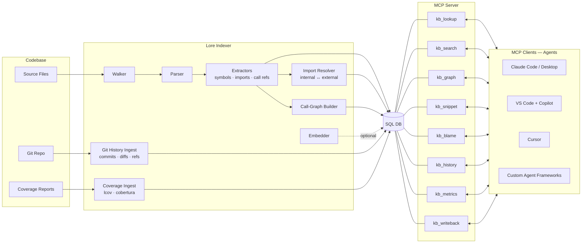

# Lore

[](https://github.com/jafreck/Lore/actions/workflows/ci.yml)
[](https://www.npmjs.com/package/@jafreck/lore)
[](LICENSE)
[](https://nodejs.org)
[](https://www.typescriptlang.org)

**The teammate that has seen it all** Lore is your agent's institutional knowledge over the codebase — it knows what was built, why it changed, and how it all connects. Lore indexes your code and git history into a structured knowledge base that agents query through MCP. It maps symbols, imports, call relationships, and git history — with optional embeddings for semantic search — so agents can reason about your codebase
without re-reading it from scratch.

## What Lore does

- Parses source files and extracts symbols, imports, and call refs
- Resolves internal vs external imports and builds call/import graph edges
- Stores everything in a normalized SQL schema with optional vector search
- Enables RAG-style retrieval with semantic/fused search
- Indexes git history (commits, touched files, refs/branches/tags)
- Supports line-level git blame through MCP
- Supports automatic refresh via watch mode, poll mode, and git hooks

## How Lore integrates with LLMs



Lore sits between your codebase and any LLM-powered tool. The **indexer**
pipeline walks source files, parses them into ASTs, and extracts
symbols/imports/call-refs via language-specific extractors, then resolves
imports (internal vs external) and builds the call graph. An optional
**embedder** generates dense vectors for semantic search, and a parallel
**git history** ingest captures commits, diffs, and refs. Everything is
persisted to a normalized SQL database. The **MCP server** then exposes that
database as a set of tools that any MCP-compatible client can call to look up
symbols, search code, traverse call graphs, read snippets, query
blame/history, and write summaries back.

The index stays fresh automatically. You can install **git hooks**
(`post-commit`, `post-merge`, etc.) that trigger an incremental refresh on
every commit, run a **watch** mode that reacts to filesystem events in
real time, or use **poll** mode for environments where watch events are
unreliable. Each refresh only re-processes files whose content hash has
changed, so updates are fast even on large repositories.

See [docs/architecture.md](docs/architecture.md) for the full schema and
pipeline breakdown.

## Supported languages

Lore currently supports extractors for:

- C, C++, C#
- Rust, Go, Java, Kotlin, Scala, Swift, Objective-C, Zig, Dart
- Python, JavaScript, TypeScript, PHP, Ruby, Lua, Bash, Elixir
- OCaml, Haskell, Julia, Elm

## Install

```bash
npm install @jafreck/lore
```

Note: Lore uses native add-ons (`tree-sitter`, `better-sqlite3`). A working
C/C++ toolchain is required the first time dependencies are built.

## Publish authentication (npm)

Lore publish operations use `NODE_AUTH_TOKEN` (see `.npmrc`) and never commit
tokens to the repository.

Local publish flow:

```bash
export NODE_AUTH_TOKEN=<npm automation token>
npm publish --access public
```

CI publish flow:

- Add `NODE_AUTH_TOKEN` as a secret in your CI provider (for GitHub Actions,
  use a repository or environment secret).
- Ensure publish jobs expose that secret as the `NODE_AUTH_TOKEN` environment
  variable before running `npm publish`.

## Release publish workflow (`@jafreck/lore@0.1.0`)

Publishing is automated by `.github/workflows/publish.yml`. Creating a version
tag (for example, `v0.1.0`) or publishing a GitHub Release triggers the npm
publish job.

Release steps for `@jafreck/lore@0.1.0`:

1. Ensure `package.json` has `"version": "0.1.0"`.
2. Push the tag: `git tag v0.1.0 && git push origin v0.1.0` (or publish a
   GitHub Release for `v0.1.0`).
3. Confirm the workflow logs show `npm publish --dry-run` output before the
   live `npm publish` step.

Post-publish verification:

- Check the package metadata: `npm view @jafreck/lore version` returns `0.1.0`.
- Confirm installability: `npm view @jafreck/lore@0.1.0 name version`.

## Quick start (CLI)

```bash
# 1) Build an index
npx @jafreck/lore index --root ./my-project --db ./kb.db

# 2) Start MCP server over stdio
npx @jafreck/lore mcp --db ./kb.db
```

## Quick start (programmatic)

```ts
import { IndexBuilder } from '@jafreck/lore';

const builder = new IndexBuilder(
  './kb.db',
  { rootDir: './my-project' },
  undefined,
  { history: true },
);

await builder.build();
```

### Programmatic configuration examples

```ts
import { IndexBuilder } from '@jafreck/lore';

// Index with embedding model + history options
await new IndexBuilder(
  './kb.db',
  {
    rootDir: './my-project',
    includeGlobs: ['src/**'],
    excludeGlobs: ['**/*.gen.ts'],
    extensions: ['.ts', '.tsx'],
  },
  undefined,
  {
    embeddingModel: 'Qwen/Qwen3-Embedding-4B',
    history: { all: true, depth: 2000 },
  },
).build();
```

## CLI reference

### lore index

Build or update a knowledge base.

```bash
npx @jafreck/lore index --root <dir> --db <path> [--embedding-model <id>] [--index-deps] [--history] [--history-depth <n>] [--history-all] [--include <glob>] [--exclude <glob>] [--language <lang>]
```

Key flags:

- `--root <dir>` required source root
- `--db <path>` required SQLite output path
- `--embedding-model <id>` embedding model identifier
- `--index-deps` opt-in dependency API indexing from direct dependency declaration files
- `--history` enable git history ingestion
- `--history-depth <n>` cap number of ingested commits
- `--history-all` traverse all refs (branches/tags)
- `--include` repeatable glob include filter
- `--exclude` repeatable glob exclude filter
- `--language` repeatable language filter (mapped to extensions)

Dependency API indexing is disabled by default and only runs when `--index-deps`
is provided (or `indexDependencies: true` in programmatic options). When
enabled, Lore indexes declaration-level public API surface from direct
dependencies across supported ecosystems:

- TypeScript/JavaScript: exported declarations from `.d.ts` files in direct npm
  dependencies declared in root `package.json` (`dependencies`,
  `devDependencies`, `peerDependencies`)
- Python: stubbed/public declarations from direct dependencies via `.pyi` and
  `py.typed` package metadata
- Go: exported declarations from direct module requirements declared in root
  `go.mod`
- Rust: `pub` declaration surface from crates declared directly in root
  `Cargo.toml`

For all ecosystems, Lore excludes implementation bodies and does not crawl
transitive dependency trees.

### lore refresh

Incremental refresh flow for an existing index.

```bash
npx @jafreck/lore refresh --db <path> --root <dir> [--index-deps] [--history] [--history-depth <n>] [--history-all]
npx @jafreck/lore refresh --db <path> --root <dir> --watch [--index-deps] [--history]
npx @jafreck/lore refresh --db <path> --root <dir> --poll [--index-deps] [--history]
```

Modes:

- Manual: one-shot incremental refresh and exit
- Watch: filesystem event driven (`fs.watch`), low latency
- Poll: periodic mtime diffing, most reliable across filesystems

Coverage reports are auto-detected during build/update/refresh from known paths (`coverage/lcov.info`, `coverage/cobertura-coverage.xml`, `coverage.xml`) and only ingested when newer than the last stored coverage run.

### lore hooks

Install repo-local git hooks that trigger Lore refresh automatically on:

- `post-commit`
- `post-merge`
- `post-checkout`
- `post-rewrite`

```bash
npx @jafreck/lore hooks --root <repo> --db <path>
npx @jafreck/lore hooks --root <repo> --db <path> --history
```

Note: for `lore hooks`, any history-related flag currently enables history in
hook-triggered refreshes.

### lore ingest-coverage

Manually ingest an explicit coverage report (useful for CI or non-standard report locations).

```bash
npx @jafreck/lore ingest-coverage --db <path> --root <dir> --file <path> --format <lcov|cobertura> [--commit <sha>]
```

Key flags:

- `--db <path>` required SQLite output path
- `--root <dir>` required repository root used to normalize relative coverage paths
- `--file <path>` required coverage report file path
- `--format <lcov|cobertura>` required coverage format
- `--commit <sha>` optional commit override (defaults to `HEAD`)

### lore mcp

Start the built-in MCP server over stdio.

```bash
npx @jafreck/lore mcp --db <path>
```

If the embedding model cannot initialize at runtime, semantic/fused search
gracefully degrades to structural search.

## MCP tools

| Tool | Purpose |
|------|---------|
| `kb_lookup` | Find symbols by name or files by path (optional branch filter), including external dependency API symbols from `external_symbols` in symbol lookups |
| `kb_search` | Structural BM25, semantic vector, or fused RRF search; structural symbol queries also include external dependency API name matches from `external_symbols` |
| `kb_graph` | Query call/import/module/inheritance edges; call edges include `callee_coverage_percent` |
| `kb_snippet` | Return source snippets by file path and line range |
| `kb_blame` | Return git blame metadata for a line or line range |
| `kb_history` | Query history by file, commit, author, ref, or recency |
| `kb_metrics` | Return aggregate index metrics plus coverage/staleness fields (`coverage_available`, `coverage_commit`, `current_commit`, `commits_behind`, `stale`, global coverage totals) |
| `kb_coverage` | Return symbol-level coverage, uncovered lines, and staleness metadata for the latest coverage run |
| `kb_writeback` | Persist symbol summaries into `symbol_summaries` |

### MCP config example

```json
{
  "mcpServers": {
    "lore": {
      "command": "npx",
      "args": ["@jafreck/lore", "mcp", "--db", "/path/to/kb.db"]
    }
  }
}
```

## Git history indexing

Lore can ingest full git history and expose it through `kb_history`.

### Indexed history tables

- `commits`: sha, author, author_email, timestamp, message, parents
- `commit_files`: per-commit touched paths with change type and diff stats
- `commit_refs`: refs currently pointing at commits (`branch`/`tag`/`other`)

### kb_history modes

- `recent`: newest commits
- `file`: commits that touched a path
- `commit`: full/prefix sha lookup (+files +refs)
- `author`: commits by author/email substring
- `ref`: commits matching branch/tag ref name substring

## Blame queries

Use `kb_blame` for line-level attribution.

Examples:

```json
{ "path": "/repo/src/index.ts", "line": 120 }
{ "path": "/repo/src/index.ts", "start_line": 120, "end_line": 140 }
{ "path": "/repo/src/index.ts", "line": 120, "ref": "main" }
```

## Automatic freshness patterns

If you want Lore to stay updated without explicit requests:

1. Run `lore hooks` once in the repo (git lifecycle updates)
2. Optionally run `lore refresh --watch` in a background session for near-real-time updates during active editing
3. Use `--poll` on filesystems where watch events are unreliable

## Benchmarking index performance (500+ file repos)

Use this procedure when you need measurable before/after evidence for indexing changes:

1. Pick a repository with at least 500 source files and note the exact commit SHA you will test.
2. Capture a baseline timing from the same machine and environment:

```bash
time npx @jafreck/lore index --root /path/to/repo --db ./kb-baseline.db
```

3. Apply your change, rebuild Lore, then capture a post-change timing against the same repository commit:

```bash
npm run build
time npx @jafreck/lore index --root /path/to/repo --db ./kb-after.db
```

4. Record both timings (baseline and post-change) in the related GitHub issue or PR under an "Acceptance Evidence" section, including repo name, commit SHA, and command used.

## Build from source

```bash
git clone https://github.com/jafreck/Lore.git
cd Lore
npm install
npm run build
```

## Contributing

Environment expectations:

- Node.js `>=22.0.0`
- Native build toolchain for `tree-sitter` and `better-sqlite3`

Common local workflow:

```bash
npm run build
npm test
npm run coverage
```

CI enforces a minimum 95% coverage threshold.

## License

[MIT](LICENSE)
