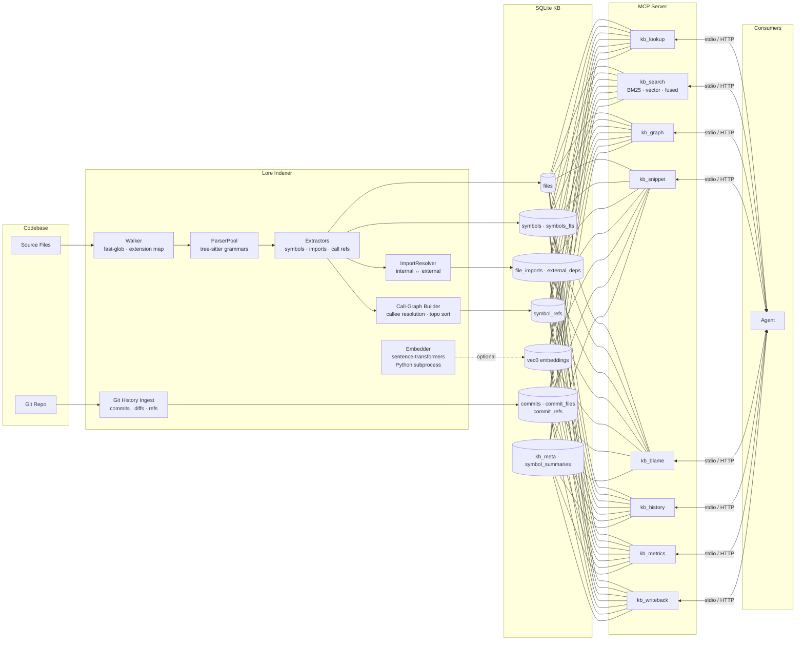

# Lore Architecture

Detailed view of Lore's indexing pipeline, storage schema, and MCP tool surface.

## Full pipeline

## Indexer stages

| Stage | Module | What it does |
|-------|--------|--------------|
| Walk | `walker.ts` | Discovers source files via `fast-glob`, maps extensions to languages |
| Parse | `parser.ts` | Lazily creates one tree-sitter `Parser` per language, caches for reuse |
| Extract | `extractors/*` | Language-specific visitors that pull symbols, imports, and call refs from the AST |
| Resolve | `resolver.ts` | Classifies each raw import as internal (resolved to a file ID) or external (third-party / stdlib) |
| Call-Graph | `call-graph.ts` | Matches raw callee names in `symbol_refs` to concrete symbol IDs; supports topo sort and cycle detection |
| Embed | `embedder.ts` | Optional — spawns a Python subprocess running sentence-transformers to produce dense vectors |
| Git History | `git-history.ts` | Ingests commits, per-file diffs, and branch/tag refs via `simple-git` |

## SQLite schema groups

| Table group | Tables | Purpose |
|-------------|--------|---------|
| Files | `files` | Indexed source files with path, branch, language, hash |
| Symbols | `symbols`, `symbols_fts` | Named code symbols + FTS5 full-text index |
| Imports | `file_imports`, `external_deps` | Import declarations resolved to file IDs or external packages |
| Call refs | `symbol_refs` | Call-site edges from caller symbol to callee symbol |
| Embeddings | `symbol_embeddings`, `symbol_semantic_embeddings` | vec0 virtual tables for dense vector search |
| History | `commits`, `commit_files`, `commit_refs` | Git commit metadata, touched files, and named refs |
| Metadata | `kb_meta`, `symbol_summaries`, `modules`, `file_modules` | Key-value config, LLM summaries, logical module groupings |

## MCP tools

| Tool | Purpose |
|------|---------|
| `kb_lookup` | Find symbols by name or files by path (optional branch filter) |
| `kb_search` | Structural BM25, semantic vector, or fused RRF search |
| `kb_graph` | Query call, import, module, or inheritance edges |
| `kb_snippet` | Return source snippets by file path and line range |
| `kb_blame` | Return git blame metadata for a line or line range |
| `kb_history` | Query history by file, commit, author, ref, or recency |
| `kb_metrics` | Return aggregate index metrics and per-branch breakdown |
| `kb_writeback` | Persist symbol summaries into `symbol_summaries` |
