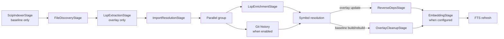

# Lore Architecture

> **Status: current source-backed reference for v0.4.0.** Historical proposals
> elsewhere in `docs/` are not authoritative for current behavior.

## High-level module layout

```
CLI
    ├─ index / one-shot refresh ──► IndexBuilder ──► IndexPipeline
    ├─ analyze ───────────────────► graph-analysis functions
    └─ mcp / watch / poll ────────► LoreRuntime

LoreRuntime
    ├─ optional lazy embedder
    ├─ optional watcher or poller
    └─ lifecycle/signal cleanup

IndexPipeline
    ├─ ScipIndexerStage
    ├─ FileDiscoveryStage
    ├─ LspExtractionStage
    ├─ ImportResolutionStage
    ├─ [LspEnrichmentStage + GitHistoryStage]  (parallel)
    ├─ ResolutionStage                         (inline)
    ├─ ReverseDepsStage                        (overlay update only)
    ├─ OverlayCleanupStage                     (baseline build/rebuild only)
    ├─ EmbeddingStage
    └─ FtsRefreshStage

MCP server ──► ToolRegistry ──► 11 toolDef/handler modules
```

`IndexBuilder` (`src/indexer/index.ts`) serializes build/update/rebuild calls
through a process-local promise chain and creates an `IndexPipeline` for each
run. One-shot `index` and `refresh` commands instantiate it directly.

`LoreRuntime` (`src/runtime.ts`) is used by MCP/watch/poll paths. It owns an
optional lazy embedding provider and watcher/poller. LSP coordinators are owned
only by the pipeline stages that use them; the formerly disconnected runtime
coordinator was removed so there is no second lifecycle or policy path.

`ToolRegistry` (`src/server/tool-registry.ts`) imports a fixed list of tool
modules dynamically and wires each exported `toolDef`/handler into the MCP
server. This is not filesystem auto-discovery.

## Full pipeline



## Pipeline stages

The indexing pipeline is decomposed into composable `PipelineStage` objects
orchestrated by `IndexPipeline` (`src/indexer/pipeline.ts`). Entries execute in
order; an array entry executes concurrently with `Promise.all`. Every stage's
`dispose()` hook runs even after a failure.

```
ScipIndexer → FileDiscovery → LspExtraction → ImportResolution
    → [LspEnrichment + GitHistory] → Resolution
    → (ReverseDeps for overlay | OverlayCleanup for baseline) → Embedding → FtsRefresh
```

The same stage array is used for build, update, and baseline rebuild. Individual
stages branch on `context.layer` or pipeline mode. There is no tree-sitter
fallback.

| Stage | Module | What it does |
|-------|--------|--------------|
| ScipIndexer | `src/indexer/stages/scip-indexer.ts` | In baseline mode, load precomputed indexes and/or run available project indexers; insert files, symbols, imports, relationships, type refs, call refs, and materialized virtual-dispatch refs. It returns immediately for overlay updates. |
| FileDiscovery | `src/indexer/stages/source-index.ts` | Discover recognized files, cache source, insert non-SCIP file snapshots, and handle overlay deletion/dirty sentinels. Despite the filename, it performs no AST extraction. |
| LspExtraction | `src/indexer/stages/lsp-extraction.ts` | Overlay only: use `documentSymbol` and outgoing call hierarchy to insert symbols/call refs, then run hover/definition enrichment for processed files. It does not insert imports, type refs, or annotations. |
| ImportResolution | `src/indexer/stages/import-resolution.ts` | Resolve `effective_file_imports` against `effective_files`; update internal targets or insert `external_deps`. |
| LspEnrichment | `src/indexer/stages/lsp-enrichment.ts` | Baseline: enrich non-SCIP files. Its overlay branch is intended to target unresolved SCIP refs, but normal `IndexBuilder.update()` runs do not carry baseline SCIP coverage markers into the new context, so that branch usually finds no SCIP files; changed-file overlay enrichment happens in `LspExtractionStage`. Files are processed three at a time. |
| GitHistory | inline in `src/indexer/index.ts` | If enabled, ingest commits, touched-file metadata, and refs concurrently with LSP enrichment. |
| FtsRefresh | `src/indexer/stages/fts-refresh.ts` | Rebuild `symbols_fts` from `effective_symbols` for baseline runs; for overlays, delete hidden stale IDs and replace only symbols from changed files. |
| Resolution | inline in `src/indexer/index.ts` | Run `resolveSymbolEdges`, scoped to overlay rows for updates. |
| ReverseDeps | `src/indexer/stages/reverse-deps.ts` | Update import and symbol reverse dependencies for overlay updates. Baseline cleanup rebuilds reverse deps after promotion. |
| Embedding | `src/indexer/stages/embedding.ts` | When a provider exists, embed symbol signature/type text and, if history is enabled, commit messages. Update mode scopes symbol work and skips unchanged embedding input hashes. |
| OverlayCleanup | `src/indexer/stages/overlay-cleanup.ts` | Baseline build/rebuild: promote the new generation, remove superseded baseline/overlay rows and dirty markers, rebuild reverse deps, and clean stale vector rows. |

### Supporting modules

| Module | What it does |
|--------|--------------|
| `discovery/walker.ts` | Discovers source files via `fast-glob`, maps extensions to languages |
| `resolution/resolver.ts` | Classifies each raw import as internal (resolved to a file ID) or external (third-party / stdlib) |
| `resolution/call-graph.ts` | Definition-containment and name-based fallback resolution; also provides file topological sorting and cycle detection |
| `resolution/graph-analysis.ts` | Higher-level graph primitives: Tarjan SCC on symbol adjacency, union-find connected components, SCC-contracted bounded clustering, and condensed codebase summary |
| `scip/*` | SCIP index reading, compilation-database handling, indexer config, and protobuf definitions |
| `lsp/*` | Language-server registry/config, JSON-RPC client, and enrichment coordinator |
| `parsing/config-parser.ts` | Parses `.env`, JSON, YAML/YML, and TOML configuration text; it is not part of source symbol extraction |
| `embeddings/embedder.ts` | Optional Transformers.js ONNX provider; default model `onnx-community/Qwen3-Embedding-0.6B-ONNX`, CPU default, `q8` default dtype, lazy initialization, and hash-based skip-unchanged symbol embeddings |
| `process-tracker.ts` | Global registry of spawned child processes; `killAllTracked()` ensures cleanup on SIGINT/SIGTERM/exit |
| `git/history.ts` | Ingests commit metadata, touched-file change types/statistics, and refs via `simple-git` |
| `resolution/resolution-method.ts` | Authoritative taxonomy for `resolution_method` column values shared by writers and readers |


## Resolution method taxonomy

The `resolution_method` column on `symbol_refs`, `type_refs`, and
`symbol_relationships` uses an authoritative taxonomy defined in
`resolution-method.ts`. Tiers are ordered from highest to lowest confidence:

| Method | Confidence | Description |
|--------|------------|-------------|
| `scip_definition` | Highest | SCIP ingestion resolved the target from compiler-produced symbol data |
| `lsp_definition` | Highest | LSP server returned a precise definition location mapped to the narrowest enclosing indexed symbol |
| `name_same_file` | High | No LSP data; callee/type name matched exactly one symbol in the same file |
| `name_single_file` | Medium | Multiple name matches all reside in one target file; the first match is selected |
| `name_unique` | Medium | No LSP data; callee/type name matched exactly one symbol in the entire index |
| `external_definition` | — | LSP definition path is outside the indexed file set (e.g. `node_modules`, stdlib) |
| `ambiguous_definition` | — | LSP definition maps to multiple equally-narrow candidates |
| `overlay_stale` | — | Reserved for stale overlay references; no current writer sets it |
| `unresolved` | — | No resolution strategy succeeded; dangling name reference |

`RESOLVED_METHODS` contains `scip_definition`, `lsp_definition`,
`name_same_file`, `name_single_file`, and `name_unique`. The other four values
are in `UNRESOLVED_METHODS` and normally have a null target.

One current implementation inconsistency is worth recording: overlay call
hierarchy insertion writes `lsp_call_hierarchy`, but that string is not present
in `RESOLUTION_METHODS` or `RESOLVED_METHODS`. Consumers that filter strictly by
the canonical set therefore do not treat that value as a resolved method.

## Current performance mechanisms

- `FileDiscoveryStage` inserts baseline file snapshots in transactions of 200.
- Full builds write to a hidden generation selected through connection-local
    effective views. SCIP subprocesses, LSP requests, and embedding calls run
    without a run-long SQLite transaction.
- LSP enrichment processes three files concurrently and commits collected
    metadata updates in a transaction per batch.
- Baseline FTS and reverse-dependency rows are staged under new row IDs while
    the active generation remains queryable. Promotion swaps the generation
    pointer and metadata in a short transaction; obsolete rows are pruned later
    in bounded transactions.
- Logical writers are serialized by both a process-local queue and a
    filesystem lease with heartbeats and stale-owner recovery.
- Embedding batches are bounded by both estimated tokens and item count; the
    next model call is overlapped with writing the prior batch.
- Update-mode symbol embeddings use companion SHA-256 hash tables to skip
    unchanged embedding text.
- The source cache is a byte-budget LRU and is cleared after LSP enrichment.
- Watch mode batches filesystem events with a 300 ms debounce; poll mode guards
    against overlapping polls.

The embedding provider is lazy and loads on its first `embed()` or explicit
`init()` call. There is no `--blocking-embedder` CLI option.

## SQLite schema groups

| Table group | Tables | Purpose |
|-------------|--------|---------|
| Files | `files` | Indexed source snapshots with absolute path, branch, language, size, hash, layer, and generation |
| Symbols | `symbols`, `symbols_fts`, `symbol_summaries` | Named symbols, FTS5 search data, and optional caller-ingested summaries |
| Imports | `file_imports`, `external_deps` | Import declarations resolved to file IDs or external packages |
| Relationships | `symbol_refs`, `symbol_relationships`, `type_refs` | Call sites, inheritance/implementation relationships, and symbol-to-type references with optional definition/type metadata |
| History | `commits`, `commit_files`, `commit_refs` | Git commit metadata, touched files, and named refs |
| Incremental state | `dirty_files`, `reverse_deps` | Branch-scoped overlay selection and file-level reverse dependencies |
| Metadata/modules | `lore_meta`, `modules`, `file_modules` | Key/value metadata and optional logical module mappings |
| Retained schema | `annotations`, `symbol_metrics`, `external_symbols` | Legacy/current query surfaces that the active pipeline does not populate |
| Embeddings | `symbol_embeddings`, `symbol_semantic_embeddings`, `commit_embeddings` | vec0 virtual tables created only after an embedding provider reports dimensions |

`EmbeddingStage` writes `symbol_embeddings` and `commit_embeddings`.
`symbol_semantic_embeddings` is written only by the programmatic
`IndexBuilder.ingestSummary()` path.

## Baseline and overlay reads

`files` and child data carry `layer` (`baseline` or `overlay`) and `generation`.
`dirty_files` uses `(path, branch)` as its primary key. The schema creates
`effective_files`, `effective_symbols`, `effective_symbol_refs`,
`effective_type_refs`, `effective_symbol_relationships`,
`effective_annotations`, and `effective_file_imports` views so an active dirty
path selects its overlay row and other paths select baseline rows.

This abstraction is not universal in v0.4.0. File/symbol query helpers and some
indexing stages use effective views, while edge queries, symbol semantic search,
cohesion/structure queries, and graph-analysis functions still contain raw-table
reads. Results over mixed baseline/overlay state can therefore vary by tool.

The MCP wrapper adds global freshness metadata to object results when possible:
`source` is `baseline` when `dirty_files` is empty and `mixed` otherwise,
accompanied by `baseline_age_s` and `dirty_file_count`.

## MCP tools

| Tool | Purpose |
|------|---------|
| `lore_lookup` | File lookup or exact/semantic/fused symbol lookup, with name/filter/pagination options |
| `lore_search` | Symbol-only structural BM25, semantic vector, or fused RRF search |
| `lore_graph` | Stored call/import/inheritance/type-dependency edges; direct or transitive traversal up to five hops |
| `lore_snippet` | Source snapshots by path/range or symbol, with optional containing-symbol metadata |
| `lore_blame` | Live Git blame, line history, or ownership analysis with optional symbol targeting |
| `lore_history` | Indexed commits by file, SHA, author, ref, recency, or semantic message similarity |
| `lore_trace` | Forward or point-to-point call paths with bounded source snippets |
| `lore_diff` | Added, removed, and changed exported symbols between indexed branches |
| `lore_cohesion` | Global directory cohesion/instability ranking by grouping depth |
| `lore_structure` | Directory import cycles, DFS-based layering violations, and weak-link outliers |
| `lore_dependents` | Symbol/file blast radius across callers, importers, subclasses, and type references |

`buildToolModules()` returns exactly these 11 modules. The existing
`src/server/tools/metrics.ts` module is not imported into this registry, so
`lore_metrics` is not available through the production MCP server.

Every registered handler returns one MCP text item containing serialized JSON.
The wrapper logs calls and injects freshness into object results. Input JSON
schemas are converted to Zod at registration time; defaults are applied by each
handler rather than by the converter.

Important query details:

- `lore_lookup` exact non-empty symbol lookup can append rows already present in
    `external_symbols` when no path/language filter is set; `lore_search` does not
    query that table.
- `lore_search` only returns symbol results. There are no documentation-result
    types or doc filters in the current tool.
- `lore_graph` reads stored edges. Virtual-dispatch refs, when available, were
    materialized during SCIP ingestion rather than at query time.
- `lore_cohesion` has no path or branch argument; it ranks directories globally.
- LSP is index-time only. Registered MCP query handlers do not start language
    servers.
