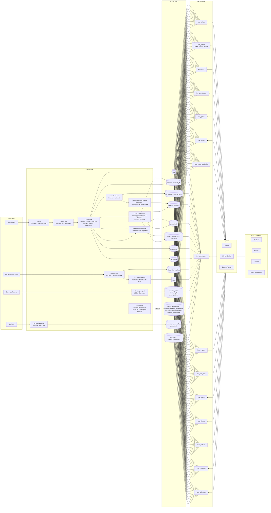

# Lore Architecture

Detailed view of Lore's indexing pipeline, storage schema, and MCP tool surface.

## High-level module layout

```
LoreRuntime              ← lifecycle owner (DB, embedder, LSP, watcher/poller)
  └─ IndexBuilder        ← façade over IndexPipeline
       └─ IndexPipeline  ← ordered, composable stage chain
            ├─ SourceIndexStage
            ├─ DocsIndexStage
            ├─ ImportResolutionStage
            ├─ DependencyApiStage
            ├─ LspEnrichmentStage
            ├─ ResolutionStage        (inline)
            ├─ TestMapStage           (inline)
            ├─ HistoryStage           (inline)
            └─ EmbeddingStage
  └─ MCP Server
       └─ ToolRegistry   ← auto-registers tools from toolDef exports
```

`LoreRuntime` (`runtime.ts`) owns all long-lived resources — database handles,
embedding providers, LSP coordinators, and file-change refreshers. Both CLI
sub-commands and the MCP server dispatch through a single runtime instance.

`IndexBuilder` (`indexer/index.ts`) is now a thin **façade** (~310 lines, down
from ~1 230) that delegates to `IndexPipeline` for both full builds and
incremental updates.

`ToolRegistry` (`lore-server/tool-registry.ts`) auto-discovers tool modules
and wires them into the MCP server from each module's exported `toolDef` /
`handler` — eliminating duplicate Zod schema definitions.

## Full pipeline



## Pipeline stages

The indexing pipeline is decomposed into composable `PipelineStage` objects
orchestrated by `IndexPipeline` (`pipeline.ts`). The stage ordering enforces
data dependencies structurally rather than by call-site discipline:

```
SourceIndex → DocsIndex → ImportResolution → DependencyApi
  → LspEnrichment → Resolution → TestMap → History → Embedding
```

The **enrichment → resolution** ordering is load-bearing: `resolveSymbolEdges`
reads `definition_path` / `definition_line` columns that are only populated
during the LSP enrichment stage.

| Stage | Module | What it does |
|-------|--------|--------------|
| SourceIndex | `stages/source-index.ts` | Walk + parse + extract + insert; handles both full-build and incremental-update (changed-file diff, stale-symbol tracking) |
| DocsIndex | `stages/docs-index.ts` | Documentation walk + chunk + note seeding; update mode processes only changed docs |
| ImportResolution | `stages/import-resolution.ts` | Resolve raw imports to file IDs using a bulk `Map<path, fileId>` lookup |
| DependencyApi | `stages/dependency-api.ts` | Optional (`--index-deps`) declaration-only indexing from direct deps across npm (`.d.ts`), Python (`.pyi` / `py.typed`), Go (`go.mod`), Rust (`Cargo.toml`); excludes transitive deps |
| LspEnrichment | `stages/lsp-enrichment.ts` | Batch-pipelined LSP hover + definition lookups (parallel per position, concurrent batches of 30); persists resolved type signature/return/definition metadata |
| Resolution | inline in `IndexBuilder` | 3-tier resolution via `call-graph.ts`: LSP containment → same-file name match → unique name match |
| TestMap | inline in `IndexBuilder` | Refresh test-to-source mappings |
| History | inline in `IndexBuilder` | Git history ingestion via `simple-git` |
| Embedding | `stages/embedding.ts` | Overlapped batch embedding — fires next `embed()` while writing current batch to DB; handles scoped re-embedding in update mode |

### Supporting modules

| Module | What it does |
|--------|--------------|
| `walker.ts` | Discovers source files via `fast-glob`, maps extensions to languages |
| `parser.ts` | Lazily creates one tree-sitter 0.25 `Parser` per language, caches for reuse |
| `extractors/*` | Language-specific AST visitors for symbols, imports, call refs, type refs, annotations, and API routes; all 23 supported languages extract call references |
| `resolver.ts` | Classifies each raw import as internal (resolved to a file ID) or external (third-party / stdlib) |
| `call-graph.ts` | 3-tier symbol resolution with LSP-first ref resolution and name-based fallback; supports topo sort and cycle detection |
| `docs.ts` | Discovers docs from default/configured globs, infers kind/title, chunks by heading hierarchy |
| `coverage.ts` | Parses LCOV/Cobertura reports, normalizes per-file/per-line hit data, persists runs linked to commit SHA/source mtime |
| `embedder.ts` | Optional — spawns a Python subprocess running sentence-transformers; async initialization with `EmbedderRef` so MCP starts immediately |
| `git-history.ts` | Ingests commits, per-file diffs, and branch/tag refs via `simple-git` |
| `resolution-method.ts` | Authoritative taxonomy for `resolution_method` column values shared by writers and readers |

Coverage ingestion accepts reports from auto-detected paths (`coverage/lcov.info`, `coverage/cobertura-coverage.xml`, `coverage.xml`) during build/update/refresh, plus manual CLI ingestion from an explicit `--file` and `--format`. LCOV/Cobertura inputs are normalized into a run (`coverage_runs`), per-file totals (`coverage_files`), and per-line hits (`coverage_lines`), which are then consumed by MCP coverage-aware tools.

Documentation ingestion runs during build and update. Defaults cover README variants, `docs/**`, ADR-style paths, and top-level architecture/design/guide/changelog files across `.md`, `.rst`, `.adoc`, and `.txt`. Markdown docs are chunked by heading hierarchy (stored with `heading_path`, line ranges, and content hashes in `doc_sections`), while non-Markdown files are stored as a single retrievable chunk.

When docs auto-notes are enabled (default), `DocsIndexStage` seeds/updates notes for README, architecture, and ADR docs with deterministic keys and `doc:<path>@<branch>` scopes. Each seeded note writes `source_hash = docs.content_hash`, which allows staleness checks to tie note freshness directly to indexed doc content.

## Resolution method taxonomy

The `resolution_method` column on `symbol_refs`, `type_refs`, and
`symbol_relationships` uses an authoritative taxonomy defined in
`resolution-method.ts`. Tiers are ordered from highest to lowest confidence:

| Method | Confidence | Description |
|--------|------------|-------------|
| `lsp_definition` | Highest | LSP server returned a precise definition location mapped to the narrowest enclosing indexed symbol |
| `name_same_file` | High | No LSP data; callee/type name matched exactly one symbol in the same file |
| `name_unique` | Medium | No LSP data; callee/type name matched exactly one symbol in the entire index |
| `external_definition` | — | LSP definition path is outside the indexed file set (e.g. `node_modules`, stdlib) |
| `ambiguous_definition` | — | LSP definition maps to multiple equally-narrow candidates |
| `unresolved` | — | No resolution strategy succeeded; dangling name reference |

`RESOLVED_METHODS` (`lsp_definition`, `name_same_file`, `name_unique`) indicates a successfully resolved target with a non-NULL `target_id`. `UNRESOLVED_METHODS` are references where `target_id` is NULL.

## Performance optimizations

Key optimizations in the indexing pipeline (v0.3.0):

- **Batch-pipelined LSP requests** — hover + definition fire in parallel per position; all targets within a file are processed in concurrent batches of 30 instead of sequential round-trips
- **Hoisted prepared statements** — 21 prepared statements created once per build/update via `initPreparedStatements()` instead of re-compiled per file
- **Stat-based change detection** — `fs.statSync().size` checked against stored `size_bytes` before reading and hashing full file content on re-index
- **Overlapped embedding batches** — all three embedding methods (structural, docs, commits) fire the next batch `embed()` while writing the current batch to DB
- **Bulk file ID map** — single `Map<path, fileId>` built from one query instead of N individual `SELECT` lookups per import
- **Batched containment resolution** — refs grouped by `definition_path`, file + symbols loaded once per path instead of 2 queries per ref
- **Async embedder initialization** — `EmbedderRef` mutable container lets MCP server start and emit READY immediately while embedding model loads in background (`--blocking-embedder` available for full capability at startup)

## SQLite schema groups

| Table group | Tables | Purpose |
|-------------|--------|---------|
| Files | `files` | Indexed source files with path, branch, language, hash |
| Symbols | `symbols`, `symbols_fts` | Named code symbols + FTS5 full-text index; includes optional persisted LSP enrichment (`resolved_type_signature`, `resolved_return_type`, `definition_uri`, `definition_path`) |
| Imports | `file_imports`, `external_deps` | Import declarations resolved to file IDs or external packages |
| Dependency APIs | `external_symbols` | Exported/public declarations from direct dependency APIs across npm, Python, Go, and Rust (ecosystem/source/package/version + symbol metadata), stored separately from in-repo symbols; includes optional persisted LSP enrichment metadata |
| Relationships | `symbol_refs`, `symbol_relationships`, `type_refs` | Call-site edges, inheritance/implements-style relationships, and symbol → referenced-type edges, including optional persisted LSP enrichment metadata |
| Annotations | `annotations` | Indexed TODO/FIXME/HACK/NOTE-style source annotations with file and line metadata |
| Routes | `api_routes` | Indexed API routes/endpoints with method, path, framework, handler, and middleware metadata |
| Docs | `docs`, `doc_sections` | Indexed docs keyed by `(path, branch)` plus chunked sections with heading metadata |
| Notes | `notes` | User/system notes keyed by `(key, scope)`; doc-scoped notes use `source_hash` to track staleness against `docs.content_hash` |
| Coverage | `coverage_runs`, `coverage_files`, `coverage_lines` | Coverage ingestion run metadata plus normalized per-file and per-line hit data |
| Embeddings | `symbol_embeddings`, `symbol_semantic_embeddings`, `doc_section_embeddings`, `commit_embeddings` | vec0 virtual tables for semantic symbol/doc-section retrieval and semantic commit-message history retrieval |
| History | `commits`, `commit_files`, `commit_refs` | Git commit metadata, touched files, and named refs |
| Metadata | `lore_meta`, `symbol_summaries`, `modules`, `file_modules` | Key-value config, LLM summaries, logical module groupings |

## MCP tools

| Tool | Purpose |
|------|---------|
| `lore_lookup` | Find symbols by name or files by path (optional branch filter), including external API symbol matches from `external_symbols` and persisted LSP-enrichment metadata when available |
| `lore_search` | Structural BM25, semantic vector, or fused RRF search; semantic/fused modes can return docs section hits and structural results are augmented by external symbol-name matches from `external_symbols`; returns persisted LSP-enrichment metadata fields when available |
| `lore_docs` | List indexed docs, fetch full docs with optional sections, or search indexed sections |
| `lore_annotations` | Return indexed source annotations by kind, with optional file-path and limit filters |
| `lore_routes` | Query extracted API routes/endpoints with optional method, path prefix, and framework filters |
| `lore_notes_read` / `lore_notes_write` | Persist notes and read note freshness metadata (`source_hash_mismatch`, `doc_missing`, etc.) |
| `lore_architecture` | Build a component-level architecture view with edges, entry/leaf nodes, and external dependency usage |
| `lore_graph` | Query call, import, module, inheritance, or type-dependency edges (`call` edges include `callee_coverage_percent`) |
| `lore_snippet` | Return snippets from indexed DB-backed file snapshots by file path + line range or by symbol name; path/symbol resolution is branch-aware and responses include containing-symbol context metadata when available |
| `lore_test_map` | Return mapped test files (with confidence) for a given source file path |
| `lore_blame` | Query blame (`mode: "blame"`), line-range evolution (`mode: "history"`), or ownership aggregates (`mode: "ownership"`), including symbol-targeted range resolution |
| `lore_history` | Query history by file, commit, author, ref, recency, or semantic commit-message similarity (with graceful fallback to recent mode when vectors are unavailable) |
| `lore_metrics` | Return aggregate index metrics plus global coverage totals and staleness metadata (`coverage_commit`, `current_commit`, `commits_behind`, `stale`) |
| `lore_coverage` | Return symbol-level coverage, uncovered lines, and staleness metadata for the latest coverage run |
| `lore_writeback` | Persist symbol summaries into `symbol_summaries` |

`lore_blame` response enrichment:
- Supports legacy `line`/`start_line`/`end_line` requests and symbol-driven targeting (`symbol` + optional `path`/`branch`), returning `resolved_symbol` when symbol resolution is used.
- History and ownership modes include enriched commit context (`commits` and per-entry `commit_context`) with commit message details, touched files, and refs/tags.
- All modes return risk indicators derived from recency, author dispersion, and churn (`risk.recency`, `risk.author_dispersion`, `risk.churn`, `risk.overall`).

`lore_lookup` request schema highlights:

- `match_mode` (`exact` | `prefix` | `contains`) is available for `kind="symbol"` lookups and defaults to `exact`.
- `symbol_kind`, `path_prefix`, and `language` are optional symbol filters.
- `limit` and `offset` are optional pagination inputs for empty-query symbol browsing (defaults: `20` and `0`).

External symbol retrieval flow:
1. Dependency API indexing is opt-in and reads declaration surfaces from direct dependencies only:
   - npm: top-level `package.json` direct deps (`dependencies` / `devDependencies` / `peerDependencies`)
   - Python: direct requirements from project dependency manifests, indexed via `.pyi` / `py.typed` declaration sources
   - Go: direct `require` entries from root `go.mod`
   - Rust: direct dependency entries from root `Cargo.toml`
2. Exported dependency declarations are persisted to `external_symbols` with package/version metadata.
3. Transitive dependencies are excluded in all ecosystems; Lore indexes only the direct boundary.
4. MCP retrieval paths include `external_symbols` for symbol-facing queries so dependency APIs can be returned alongside in-repo symbols in `lore_lookup` and structural `lore_search`.

Query-time behavior:
- LSP servers are index-time only. MCP/Lore query handlers do not spawn or call language servers.
- `lore_lookup` and `lore_search` read persisted enrichment fields directly from SQLite.
