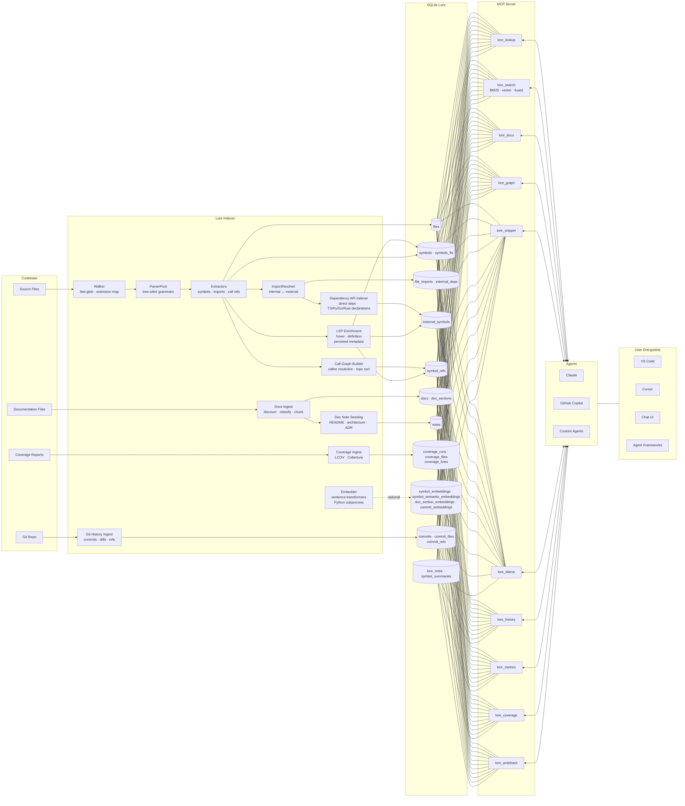

# Lore Architecture

Detailed view of Lore's indexing pipeline, storage schema, and MCP tool surface.

## Full pipeline

## Indexer stages

| Stage | Module | What it does |
|-------|--------|--------------|
| Walk | `walker.ts` | Discovers source files via `fast-glob`, maps extensions to languages |
| Parse | `parser.ts` | Lazily creates one tree-sitter `Parser` per language, caches for reuse |
| Extract | `extractors/*` | Language-specific visitors that pull symbols, imports, and call refs from the AST |
| Resolve | `resolver.ts` | Classifies each raw import as internal (resolved to a file ID) or external (third-party / stdlib) |
| Dependency APIs | `index.ts` dependency API pass | Optional (`--index-deps`) declaration-only indexing from direct dependencies across npm (`.d.ts`), Python (`.pyi` / `py.typed`), Go (direct `go.mod` requirements), and Rust (direct `Cargo.toml` crates); excludes transitive dependencies and implementation bodies |
| Call-Graph | `call-graph.ts` | Matches raw callee names in `symbol_refs` to concrete symbol IDs; supports topo sort and cycle detection |
| Docs ingest | `docs.ts` + `IndexBuilder` | Discovers docs from default/configured globs, infers kind/title, persists docs plus retrievable sections/chunks, and optionally seeds doc-scoped notes |
| LSP Enrichment | `lsp/enrichment.ts` | Optional index-time language-server hover/definition lookups; persists resolved type signature/return/definition metadata into SQLite |
| Coverage | `coverage.ts` | Parses LCOV/Cobertura reports, normalizes per-file/per-line hit data, and persists a run linked to commit SHA/source mtime |
| Embed | `embedder.ts` | Optional — spawns a Python subprocess running sentence-transformers to produce dense vectors |
| Git History | `git-history.ts` | Ingests commits, per-file diffs, and branch/tag refs via `simple-git` |

Coverage ingestion accepts reports from auto-detected paths (`coverage/lcov.info`, `coverage/cobertura-coverage.xml`, `coverage.xml`) during build/update/refresh, plus manual CLI ingestion from an explicit `--file` and `--format`. LCOV/Cobertura inputs are normalized into a run (`coverage_runs`), per-file totals (`coverage_files`), and per-line hits (`coverage_lines`), which are then consumed by MCP coverage-aware tools.

Documentation ingestion runs during build and update. Defaults cover README variants, `docs/**`, ADR-style paths, and top-level architecture/design/guide/changelog files across `.md`, `.rst`, `.adoc`, and `.txt`. Markdown docs are chunked by heading hierarchy (stored with `heading_path`, line ranges, and content hashes in `doc_sections`), while non-Markdown files are stored as a single retrievable chunk.

When docs auto-notes are enabled (default), `IndexBuilder` seeds/updates notes for README, architecture, and ADR docs with deterministic keys and `doc:<path>@<branch>` scopes. Each seeded note writes `source_hash = docs.content_hash`, which allows staleness checks to tie note freshness directly to indexed doc content.

## SQLite schema groups

| Table group | Tables | Purpose |
|-------------|--------|---------|
| Files | `files` | Indexed source files with path, branch, language, hash |
| Symbols | `symbols`, `symbols_fts` | Named code symbols + FTS5 full-text index; includes optional persisted LSP enrichment (`resolved_type_signature`, `resolved_return_type`, `definition_uri`, `definition_path`) |
| Imports | `file_imports`, `external_deps` | Import declarations resolved to file IDs or external packages |
| Dependency APIs | `external_symbols` | Exported/public declarations from direct dependency APIs across npm, Python, Go, and Rust (ecosystem/source/package/version + symbol metadata), stored separately from in-repo symbols; includes optional persisted LSP enrichment metadata |
| Call refs | `symbol_refs` | Call-site edges from caller symbol to callee symbol, including optional persisted LSP enrichment metadata |
| Docs | `docs`, `doc_sections` | Indexed docs keyed by `(path, branch)` plus chunked sections with heading metadata |
| Notes | `notes` | User/system notes keyed by `(key, scope)`; doc-scoped notes use `source_hash` to track staleness against `docs.content_hash` |
| Coverage | `coverage_runs`, `coverage_files`, `coverage_lines` | Coverage ingestion run metadata plus normalized per-file and per-line hit data |
| Embeddings | `symbol_embeddings`, `symbol_semantic_embeddings`, `doc_section_embeddings`, `commit_embeddings` | vec0 virtual tables for semantic symbol/doc-section retrieval and semantic commit-message history retrieval |
| History | `commits`, `commit_files`, `commit_refs` | Git commit metadata, touched files, and named refs |
| Metadata | `lore_meta`, `symbol_summaries`, `modules`, `file_modules` | Key-value config, LLM summaries, logical module groupings |

## MCP tools

| Tool | Purpose |
|------|---------|
| `lore_lookup` | Find symbols by name or files by path (optional branch filter), including external API symbol matches from `external_symbols` and persisted LSP-enrichment metadata when available |
| `lore_search` | Structural BM25, semantic vector, or fused RRF search; semantic/fused modes can return docs section hits and structural results are augmented by external symbol-name matches from `external_symbols`; returns persisted LSP-enrichment metadata fields when available |
| `lore_docs` | List indexed docs, fetch full docs with optional sections, or search indexed sections |
| `lore_graph` | Query call, import, module, or inheritance edges (`call` edges include `callee_coverage_percent`) |
| `lore_snippet` | Return snippets from indexed DB-backed file snapshots by file path + line range or by symbol name; path/symbol resolution is branch-aware and responses include containing-symbol context metadata when available |
| `lore_blame` | Query blame (`mode: "blame"`), line-range evolution (`mode: "history"`), or ownership aggregates (`mode: "ownership"`), including symbol-targeted range resolution |
| `lore_history` | Query history by file, commit, author, ref, recency, or semantic commit-message similarity (with graceful fallback to recent mode when vectors are unavailable) |
| `lore_metrics` | Return aggregate index metrics plus global coverage totals and staleness metadata (`coverage_commit`, `current_commit`, `commits_behind`, `stale`) |
| `lore_coverage` | Return symbol-level coverage, uncovered lines, and staleness metadata for the latest coverage run |
| `lore_notes_read` / `lore_notes_write` | Persist notes and read note freshness metadata (`source_hash_mismatch`, `doc_missing`, etc.) |
| `lore_writeback` | Persist symbol summaries into `symbol_summaries` |

`lore_blame` response enrichment:
- Supports legacy `line`/`start_line`/`end_line` requests and symbol-driven targeting (`symbol` + optional `path`/`branch`), returning `resolved_symbol` when symbol resolution is used.
- History and ownership modes include enriched commit context (`commits` and per-entry `commit_context`) with commit message details, touched files, and refs/tags.
- All modes return risk indicators derived from recency, author dispersion, and churn (`risk.recency`, `risk.author_dispersion`, `risk.churn`, `risk.overall`).

`lore_lookup` request schema highlights:

- `match_mode` (`exact` | `prefix` | `contains`) is available for `kind="symbol"` lookups and defaults to `exact`.
- `symbol_kind`, `path_prefix`, and `language` are optional symbol filters.
- `limit` and `offset` are optional pagination inputs for empty-query symbol browsing (defaults: `20` and `0`).

External symbol retrieval flow:
1. Dependency API indexing is opt-in and reads declaration surfaces from direct dependencies only:
   - npm: top-level `package.json` direct deps (`dependencies` / `devDependencies` / `peerDependencies`)
   - Python: direct requirements from project dependency manifests, indexed via `.pyi` / `py.typed` declaration sources
   - Go: direct `require` entries from root `go.mod`
   - Rust: direct dependency entries from root `Cargo.toml`
2. Exported dependency declarations are persisted to `external_symbols` with package/version metadata.
3. Transitive dependencies are excluded in all ecosystems; Lore indexes only the direct boundary.
4. MCP retrieval paths include `external_symbols` for symbol-facing queries so dependency APIs can be returned alongside in-repo symbols in `lore_lookup` and structural `lore_search`.

Query-time behavior:
- LSP servers are index-time only. MCP/Lore query handlers do not spawn or call language servers.
- `lore_lookup` and `lore_search` read persisted enrichment fields directly from SQLite.
